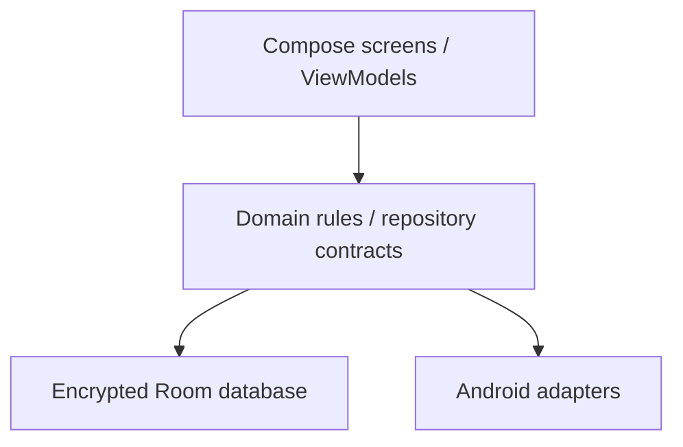
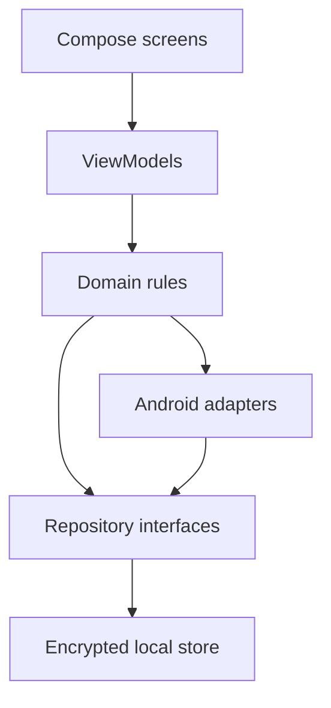
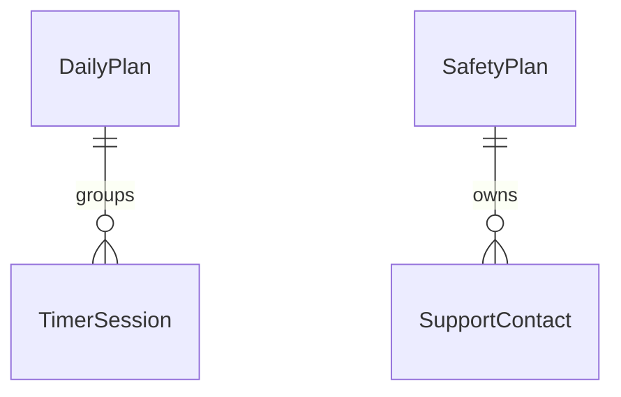

# Steady: merged Android architecture

*READ THIS FIRST*

**A private, accessible daily workspace for Thanu.** This document merges your supplied Claude blueprint, my earlier Steady proposal, and your 30-day improvement guide into one implementation plan.

Prepared 6 October 2026. Architecture revision 1.1. Working name: Steady; it can be renamed ThanuOS after your existing dashboard assets are available. Designed for ongoing daily use, with no 30-day expiry or subscription requirement.

### The first release

Five screens: Today, Break, Safety, Review, and Settings. Fully offline operation, encrypted records, minimum day, non-visual timer cues, optional lock, selective Markdown export, and a small food reference. Recovery backup covers eligible organiser data; the private Safety plan remains device-only.

### The deliverable you asked for

This is the architecture PDF before building: behaviour, packages, entities, platform adapters, acceptance tests, phased backlog and eight agent briefs, plus meal examples and nutrient food sources. The three-week target refers to an initial build iteration, not the app’s useful life. No APK or completed build is claimed.

> Implementation is paused. No Android SDK, connected phone harness, native build, installation, or real-device verification is available in this session. Proposed components become verified implementation only after their milestone evidence passes.

### How to read it

Read the merge decisions and v0.1 contract first. Use the architecture and build-kit parts when implementing. The contents and PDF bookmarks provide navigation; text is selectable for zoom and text-to-speech. The PDF is not certified as PDF/UA.

## Contents

| Section | PDF page |
| --- | --- |
| [Assumptions and evidence](#assumptions-and-evidence) | 5 |
| [What changed in the merge](#what-changed-in-the-merge) | 6 |
| [Product rules and success](#product-rules-and-success) | 7 |
| [Landscape: verified pattern sources](#landscape-verified-pattern-sources) | 8 |
| [Landscape: additional sources](#landscape-additional-sources) | 9 |
| [Research coverage and remaining checks](#research-coverage-and-remaining-checks) | 10 |
| [Feature merge list](#feature-merge-list) | 11 |
| [The v0.1 contract](#the-v01-contract) | 12 |
| [First-release acceptance contract](#first-release-acceptance-contract) | 13 |
| [Modules 1–2: Today and Break](#modules-12-today-and-break) | 14 |
| [Modules 3–4: Learn and Build](#modules-34-learn-and-build) | 15 |
| [Modules 5–7: care records](#modules-57-care-records) | 16 |
| [Modules 8, 10–11: reflection and support](#modules-8-1011-reflection-and-support) | 17 |
| [Module 9: the offline Safety plan](#module-9-the-offline-safety-plan) | 18 |
| [Modules 12–14: review, capture, export](#modules-1214-review-capture-export) | 19 |
| [Roadmap and explicit cuts](#roadmap-and-explicit-cuts) | 20 |
| [Pacing and the first 30 days](#pacing-and-the-first-30-days) | 21 |
| [Daily use beyond the first month](#daily-use-beyond-the-first-month) | 22 |
| [Food support inside the app](#food-support-inside-the-app) | 23 |
| [What to eat: a repeatable daily template](#what-to-eat-a-repeatable-daily-template) | 24 |
| [Vitamins and minerals: food sources](#vitamins-and-minerals-food-sources) | 25 |
| [Supplements: the decision boundary](#supplements-the-decision-boundary) | 26 |
| [Stack choice](#stack-choice) | 27 |
| [Layers and data flow](#layers-and-data-flow) | 28 |
| [Diagram code and package map](#diagram-code-and-package-map) | 29 |
| [Navigation and daily flows](#navigation-and-daily-flows) | 30 |
| [Data model: classes and core fields](#data-model-classes-and-core-fields) | 31 |
| [Data model: support and configuration](#data-model-support-and-configuration) | 32 |
| [Relations, indices and migrations](#relations-indices-and-migrations) | 33 |
| [Encrypted storage and key lifecycle](#encrypted-storage-and-key-lifecycle) | 34 |
| [Threat model and privacy boundary](#threat-model-and-privacy-boundary) | 35 |
| [Export, backup, restore and deletion](#export-backup-restore-and-deletion) | 36 |
| [Android rules: alerts and background work](#android-rules-alerts-and-background-work) | 37 |
| [Timer state machine and time policy](#timer-state-machine-and-time-policy) | 38 |
| [Android rules: files, system UI and OEMs](#android-rules-files-system-ui-and-oems) | 39 |
| [Accessibility as a component contract](#accessibility-as-a-component-contract) | 40 |
| [Manual accessibility audit script](#manual-accessibility-audit-script) | 41 |
| [Test layers and device matrix](#test-layers-and-device-matrix) | 42 |
| [Timer reliability evidence](#timer-reliability-evidence) | 43 |
| [AI and integrations: later only](#ai-and-integrations-later-only) | 44 |
| [Build environment and dependency gate](#build-environment-and-dependency-gate) | 45 |
| [Phone-centred development and release](#phone-centred-development-and-release) | 46 |
| [AGENTS.md content](#agentsmd-content) | 47 |
| [Milestone 1: prove the scaffold](#milestone-1-prove-the-scaffold) | 48 |
| [Milestone 2: encrypted repository](#milestone-2-encrypted-repository) | 49 |
| [Milestone 3: Today and minimum day](#milestone-3-today-and-minimum-day) | 50 |
| [Milestone 4: local Safety route](#milestone-4-local-safety-route) | 51 |
| [Milestone 5: non-visual Break](#milestone-5-non-visual-break) | 52 |
| [Milestone 6: sparse weekly review](#milestone-6-sparse-weekly-review) | 53 |
| [Milestone 7: privacy and recovery](#milestone-7-privacy-and-recovery) | 54 |
| [Milestone 8: installation readiness](#milestone-8-installation-readiness) | 55 |
| [Small prompt pack](#small-prompt-pack) | 56 |
| [Risk register: delivery and reliability](#risk-register-delivery-and-reliability) | 57 |
| [Risk register: quality and human costs](#risk-register-quality-and-human-costs) | 58 |
| [Release checklist](#release-checklist) | 59 |
| [Open decisions and first three actions](#open-decisions-and-first-three-actions) | 60 |
| [Sources: app patterns and support](#sources-app-patterns-and-support) | 61 |
| [Sources: Android platform](#sources-android-platform) | 62 |
| [Sources: dependencies and input audit](#sources-dependencies-and-input-audit) | 63 |
| [Sources: diet and nutrients](#sources-diet-and-nutrients) | 64 |

## Assumptions and evidence

*PART 1 / FOUNDATIONS*

### Authority and limits

Your latest instruction requests one complete PDF before building; it overrides the supplied prompt’s four-message “continue” delivery rule. All four parts appear here. The improvement guide controls workload, routines, tone, and support-plan content where inputs disagree.

The design uses your stated need for accessible reading, rapid initial grasp followed by consolidation time, fluctuating energy, college obligations, a team project, and practical AI-assisted work. These are design inputs, not diagnoses, intelligence measurements, or personality conclusions.

### Known versus still unknown

- **User context:** Xiaomi 14 and a Windows laptop are reported. Current Android/HyperOS build, accessibility services, offline voice availability, and any current care restrictions must be inspected; older device snapshots are not current evidence.
- **Unverified:** exact mobile-harness app, Antigravity CLI commands, account integrations, and permissions. The workflow below is a proposed interface contract, not a claim that I can access that harness.
- **Unverified:** ThanuOS dashboard files are not attached. Reuse the stated black/high-contrast direction, not invented existing components.
- **Assumption:** English first, personal use, one app module, four short build sessions weekly. These are reversible defaults.

### Verification labels

**Verified [n]** means a linked primary source was retrieved on 6 October 2026, for the specific claim only. **Unverified** means a named research seed or incomplete check. **Design** means a proposed choice. A vendor feature description is not an independent privacy, accessibility, or device-reliability audit.

**Product summary:** Steady reduces daily planning and visual effort while preserving practical learning, finished work, human support, and control over personal data. It assists routines; it does not judge the user or provide treatment.

## What changed in the merge

*PART 1 / DECISION RECORD*

- **Scope:** my original Today/Focus/Learn/Projects/Review/Settings outline becomes five screens. Learn and full project tooling move to v0.2; the first version concentrates on daily essentials.
- **Storage:** the early simple local-state proposal is superseded by a fully encrypted database and explicit key lifecycle. Plain DataStore is permitted only for non-personal bootstrap preferences.
- **Support plan:** the supplied prompt assumes a clinician-agreed plan exists. The guide does not establish that. Ship optional, empty personal fields and a review-with-clinician label; never prefill a medical history or claim approval.
- **Timers:** “survive everything” becomes persisted timer state plus tested alert modes. Force-stop, power-off, denied permissions, and OEM restrictions have explicit limits; an overdue alert is handled calmly.
- **Privacy conflict:** “Safety data never leaves the device” takes precedence over “full export.” Portable backup excludes Safety. “Full” means all backup-eligible organiser data, with this exclusion named in the UI.
- **Accessibility:** large text, audio/haptics, TalkBack, lower motion, and a softer theme are requirements from the first scaffold. Black is a user preference, not a medical assertion that black is best.
- **Timing:** a three-week target is retained as a workload cap, not a delivery guarantee. Encryption, recovery and actual-device checks can require extra short sessions. Cut later features before cutting these safeguards.
- **Reuse:** combine useful interaction patterns through new implementation. Do not merge whole repositories, proprietary screens, GPL code, or unknown dependency licences into a new project.

> This revision is the source of truth for subsequent app work. Any earlier partial scaffold or prompt must be reconciled with it before implementation resumes.

## Product rules and success

*PART 1 / PRINCIPLES*

- **Three priorities:** health routines, education, and one build commitment. Other ideas stay parked. The app itself must not displace exams or the team project. Guide pages 2, 5, 8.
- **Minimum day:** suggested 10-minute study, 10-minute build step, and 5-minute comfortable movement if appropriate. Rest/care can take priority. No debt, punitive streak, overdue colour, score, leaderboard, or catch-up queue. Guide pages 2 and 17.
- **Anchors:** after waking, returning from college, and before sleep. Clock alerts are optional aids; they are not proof that a routine happened. Guide page 5.
- **Evidence:** a short explanation, solved example, tested flow, change reference, or next action. Empty evidence stays empty; it never means failure. Guide pages 6–10.
- **Interaction budget:** essential daily actions should take under two minutes in a manual usability test. Logging, review, and detailed setup are optional. One tap pauses routine nudges.
- **Notification budget:** default maximum five automatic routine alerts per logical day, including optional snoozes. Explicitly started timer completions are a separate disclosed class. Quiet hours follow the chosen sleep window.
- **Boundaries:** no medical advice, diagnostic labels, personality scores, companion persona, manipulative praise, or inferred risk scoring. The app links to people and care providers. Guide pages 4, 13–15, 19.

### What a successful first month looks like

You can plan, pause, start a break, retrieve support information, and see a factual weekly record without visual strain or substantial upkeep. You can stop using the app and keep exported organiser notes. Measure whether friction falls; do not promise better grades, restored vision, mental-health improvement, or hackathon wins.

## Landscape: verified pattern sources

*PART 1 / RESEARCH*

This is a focused source audit. Features below are verified from their named official sources; accessibility, background performance, tracker absence, and complete maintenance history are not independently tested.

### Loop Habit Tracker

**Verified [1,2]:** repository is GPL-3.0; official listing describes offline use, reminders and export. Listing update shown: 14 September 2025. **Borrow:** low-friction routine entries and data portability. **Change:** anchor-based choices, no streak pressure. No source code is reused.

### Tasks.org

**Verified [3,4]:** GPL-3.0 repository and official Android listing; listing update shown: 11 September 2026. **Borrow:** small actionable tasks and flexible reminders. **Change:** three priorities, no overdue debt. Optional sync is not brought into v0.1.

### Anki / AnkiDroid

**Verified [5,6]:** official Anki site describes audio and review tools; AnkiDroid repository exists. Exact repository licence and latest Android release were not fully checked. **Borrow later:** scheduled recall and explain-aloud cards. **Change:** one useful review, no growing mandatory daily queue.

### Joplin

**Verified [7,8]:** official documentation describes offline-first notes; privacy policy lists external service interactions. Exact licence and latest app update were not pinned in this audit. **Borrow:** plain Markdown ownership. **Change:** local export only, no sync or plugin ecosystem. Offline-first does not establish that every feature is offline.

### Orgzly Revived

**Verified [9]:** community-maintained outliner; repository states GPL version 3 or later and that original Orgzly development halted. Latest release date not established. **Borrow later:** capture then organise. **Change:** flat parking list before complex outlines. No code reuse.

## Landscape: additional sources

*PART 1 / RESEARCH*

### Forest

**Verified [10]:** official site describes a focus timer with a growing forest. Current Android update and detailed data handling remain unverified. **Borrow:** a clear session boundary. **Avoid:** punishment, competitive comparisons, and decorative visual work. Do not copy its assets or brand.

### Medisafe

**Verified [11]:** official help describes user-entered medication and refill reminders. Latest app update, privacy implementation, and reliability are not audited. **Borrow later:** user-entered reminder times. **Change:** date-only refill reminder; no dose advice, interactions, stock quantities, or automatic contact sharing.

### Bearable

**Verified [12]:** official site describes symptom, sleep and mood tracking. Maintenance date and complete privacy audit are unverified. **Borrow later:** optional factual entries. **Change:** no correlations presented as causes and no clinical interpretation or exhaustive tracking.

### Daylio

**Verified [13]:** official help describes editable mood choices. Maintenance date and complete privacy audit are unverified. **Borrow later:** quick user-selected words. **Change:** no mood score, streak, or mood-to-productivity judgment.

### Safety and accessibility references

**Verified [14]:** Stanley–Brown Safety Planning resource describes an established structured approach. Borrow its organisation, not a proprietary form or therapeutic claim. **Verified [15,16]:** Android accessibility documentation and its official video catalogue. No listed video was watched here; its existence is verified, its tutorial content is not.

> For closed-source apps, a code-reuse licence is not established. Vendor pages provide feature ideas only. For any dependency that is actually added, inspect its exact licence and transitive dependencies separately.

## Research coverage and remaining checks

*PART 1 / RESEARCH BACKLOG*

The supplied prompt asks for three to six candidates per category. This list provides comparison candidates without pretending every candidate received a complete audit. V = feature/source verified above; U = supplied seed or further candidate still unverified.

- **Habits:** Loop V; Tasks.org V; Habitica U.
- **Focus:** Forest V; Tasks.org V for reminders; Loop V for routine cues. Specific non-visual timer suitability remains untested.
- **Eye breaks:** Android accessibility resources V; Forest V for timing only; Loop V for reminder patterns only. No eye-care efficacy is inferred.
- **Medication/appointments:** Medisafe V; Tasks.org V for dates; Bearable V for optional logs.
- **Sleep/symptoms:** Bearable V; Daylio V for entries; Loop V for simple routine recording.
- **Learning:** Anki V; AnkiDroid V; Joplin V for supporting notes.
- **Projects/hackathons:** Tasks.org V; Orgzly Revived V; Joplin V. Rubric/acceptance gates come from your guide, not a claimed native feature of all three.
- **Low vision:** Android Compose guidance V; Android general accessibility guidance V; Google accessibility tools U pending specific service/Play listing checks.
- **Markdown:** Joplin V; Orgzly Revived V for outlines, not Markdown; Obsidian U for Android export compatibility to be device-tested.
- **Safety:** Stanley–Brown V as structure; MY3 U; Virtual Hope Box U. Do not assume the two apps are currently available or maintained.
- **Spending:** Tasks.org V for renewal dates; Joplin V for review notes; Habitica U. A dedicated spending-app comparison remains open.

Before borrowing another pattern, record official URL, platform availability, licence where relevant, exact update date or “not established,” data-handling policy, and accessibility evidence. Prefer recent official videos; the retrieved 2025 catalogue is older than the requested 12-month window. Do not delay v0.1 to exhaust this landscape.

## Feature merge list

*PART 1 / WHY THESE FEATURES*

| Source pattern | Refined behaviour |
| --- | --- |
| Loop / Tasks.org [1–4] | Three anchor-based priorities, minimum day, neutral pause; remove streaks and overdue pressure. |
| Forest timing [10] | A simple break boundary with sound/haptics; remove competitive and decorative mechanics. |
| Anki [5,6] + guide 6–7 | Explain, retrieve, correct, revisit. A bounded review choice instead of an accumulating queue. |
| Joplin [7,8] + guide 2 | Portable Markdown with a preview and explicit privacy exclusions. No account or sync required. |
| Orgzly [9] + guide 8–10 | Capture ideas, park scope, require evidence before expanding the build. |
| Stanley–Brown [14] + guide 19 | Optional local support fields, clinician review, fixed helplines, immediate offline access to public help. |
| Bearable / Daylio [12,13] | Optional factual entries later, without scores, correlations, diagnoses, or forced journaling. |
| Medisafe [11] + guide 13 | User-entered instructions and dates later; no prescription intelligence or quantity tracking. |
| Guide 15–18 | People, purchase waiting period, five indicators, and four review questions; implemented as modest local tools. |

> Sources support the original pattern; the personalised behaviour is our design. “Merged” means a coherent feature selection and architecture, not copied implementations.

## The v0.1 contract

*PART 2 / PRODUCT AND ROADMAP*

### Six lines that control the build

- **User:** one engineering student who wants accessible, low-effort planning on a personal Android phone.
- **Problem:** planning, screen-heavy work, and fragmented notes consume limited time and attention.
- **Main flow:** choose three priorities → do or pause a small step → start a break if useful → record optional evidence → review a week. Public help is accessible independently.
- **Evidence:** an installed offline app passes the five-screen acceptance checks, timer matrix, encrypted-storage inspection, migration/recovery checks, and TalkBack task script.
- **Excluded:** accounts, internet/AI, OCR, recording, medical automation, social feeds, dashboards full of statistics, 3D effects, and background phone control.
- **Owner and date:** Thanu owns decisions; the coding agent implements bounded changes. Target a three-week core iteration, with release only after tests. No fixed launch date is imposed.

### Five screens; sheets do not become hidden extra modules

Today includes small editing and shutdown sheets. Break includes its cue settings. Safety includes its local editor. Review includes weekly questions and the 30-day sequence. Settings holds access, privacy, export and diagnostics. A bottom navigation bar shows Today, Break, Safety, Review; Settings opens from a labelled toolbar control.

> The Safety destination is always visible on application screens and sheets. Public emergency actions also appear on the app-lock surface. A permission dialog or system dialer is an Android surface, not an app-controlled guarantee.

## First-release acceptance contract

*PART 2 / GATES*

- **Today/food:** retrieve saved priorities after process death; minimum day creates no debt. Its local Food ideas sheet reads vegetarian/mixed options aloud and honours entered avoid-foods.
- **Pause:** one tap disables routine nudges; resume does not replay missed reminders. Safety remains available. Active timer handling is explicitly shown.
- **Break:** start, pause, resume and stop using TalkBack or large buttons. State is restored after process recreation; completion behaviour matches the tested permission mode.
- **Safety:** in airplane mode, reach public help from any app destination in one tap and personal fields after authentication when locked. An empty plan still exposes helplines; editing requires no internet.
- **Review:** select any recent week, see five optional indicators and four questions, with missing values displayed as “not recorded.” No ranking or clinical interpretation.
- **Local privacy:** database content and journal files are encrypted; merged manifest contains no INTERNET permission, analytics, or upload service. App-lock setting is enforced on return.
- **Markdown:** preview selected daily/weekly organiser fields, choose a destination through Android, write UTF-8 notes, and reopen one successfully. Safety is never exported.
- **Recovery:** create and restore a passphrase-protected backup of eligible organiser data on a second installation. Wrong password, damaged file, and invalid schema leave current records unchanged.
- **Delete:** an explicit destructive confirmation deletes local records and key material and cancels reminders. Explain that previously exported files require separate deletion.
- **Accessibility:** essential daily flow passes TalkBack and maximum available font/display scale; measured key text contrast at least 7:1; no required visual-only gesture.

> These are proposed acceptance conditions, not test results. All must have milestone evidence before the build is described as ready.

## Modules 1–2: Today and Break

*PART 2 / MODULE SPECIFICATIONS*

### 1. Today — v0.1; guide 2, 5, 17–18

**Story:** choose a small day without opening a full task manager. **Behaviour:** health, study, build, next action; event-anchor labels; minimum-day toggle; optional end-of-day evidence and shutdown; sleep window in Settings.

**Data:** logical date, timezone/boundary snapshot, mode, three task texts, next action, optional evidence, shutdown time. **Acceptance:** save and retrieve the same day across midnight until its configured boundary. **Edges:** travel, daylight-saving regions, late sessions, empty days, pause and clock changes.

**Pattern:** verified Loop/Tasks.org simplicity [1–4], adapted by design. **Avoid:** overdue debt, mandatory completion, long onboarding, task multiplication. Essential daily actions aim for under two minutes.

### 2. Focus and breaks — v0.1; guide 5, 13

**Story:** receive an optional break cue without watching a screen. **Behaviour:** choose study/build/custom duration, start, pause, resume, stop; sound/haptic preview; eyes-closed mode and a dim-screen toggle that preserves navigation.

**Data:** timer ID, mode, duration, state, timestamps, boot marker, remaining time, cue choices. **Acceptance:** state restores and a tested completion cue occurs in each supported mode. **Edges:** permission denial, DND, low volume, missing offline TTS, OEM killing, force-stop, reboot.

**Pattern:** Forest’s session boundary [10] plus Android timing APIs [19–22]. **Change:** no gamification. Study 25–40 and build 35–45 minutes with 5–10-minute breaks are adjustable examples. 20-20-20 and two-minute eyes-closed presets are optional later choices, never treatments or claims of restored vision.

## Modules 3–4: Learn and Build

*PART 2 / MODULE SPECIFICATIONS*

### 3. Learn — v0.2; guide 6–7

**Story:** turn initial understanding into something recallable. **Behaviour:** Understand → Retrieve → Check → Return; four-state topic board; explain-aloud and trace-an-input cards; optional VTU answer template. Question banks stay reference material.

**Data:** topic, source reference, card prompt, correction, next review date, user-selected outcome; audio only in a later opt-in subphase. **Acceptance:** create one card, retrieve, record a correction, and schedule a later review without creating a debt queue.

**Edges:** difficult material, missed dates, bad OCR, absent offline voice model, technical notation. **Pattern:** Anki [5,6]. **Avoid:** grading intelligence, unverified correctness, compulsory cards. Voice answers and OCR require separate privacy and accuracy checks.

### 4. Build — v0.2; guide 8–10

**Story:** finish a demonstrated flow rather than expand scope. **Behaviour:** six-line contract, one acceptance condition before adding a feature, owner/date, evidence, and next action. Hackathon submode adds brief/rubric, feature freeze, rehearsal and permitted fallback.

**Data:** project fields, criteria, scope decisions, references, milestone evidence, optional two-candidate model-comparison log. **Acceptance:** generate a bounded agent brief from one goal and criterion; no unrelated personal data appears in it.

**Edges:** guide feedback changes, teamwork conflict, inconsistent briefs, unreliable network demo. **Pattern:** Tasks.org/Orgzly/Joplin organisation [3,7,9]; rubric and evidence gates are from the guide. **Avoid:** automatic execution, unlimited model comparisons, external posting, or replacing the team’s existing workflow.

## Modules 5–7: care records

*PART 2 / MODULE SPECIFICATIONS*

### 5. Body — v1.0; guide 11–13

**Story:** optionally note comfortable movement, sleep and meals. **Data:** user-selected activity, duration, comfort description, sleep window and optional note. **Acceptance:** an empty week remains valid; no target or workout appears as a prescription.

**Edges:** illness, restrictions, balance difficulty, recording fatigue. **Pattern:** optional Bearable-style entries [12], without clinical conclusions. **Avoid:** calorie goals or progressive exercise prescriptions. A static stop-signs note says stop activity for pain, dizziness, unusual breathlessness or poor balance and follow existing care instructions.

### 6. Medication and appointments — v1.0; guide 13, 19

**Story:** remember user-entered clinician/pharmacist instructions. **Data:** typed label/instruction, time or appointment date, optional completion timestamp, refill date only. **Acceptance:** scheduling reproduces the entered text and never alters a dose or adds an interaction recommendation.

**Edges:** updated prescription, timezone travel, duplicate reminders, cancelled visit, privacy on lock screen. **Pattern:** Medisafe reminder structure [11]. **Avoid:** stock quantities, treatment suggestions, default supplement entries, or adherence scores. Agreed safe storage takes precedence; app reminders are not a clinical safety guarantee.

### 7. Clinician summary — v1.0; guide 13

**Story:** bring a factual seven-day record to an appointment. **Data:** selected sleep, fatigue, concentration, entered medication timing and activity. **Acceptance:** export one plain-language page with date range, missingness, and no causal/diagnostic interpretation.

**Edges:** sparse data, corrections, contradictory entries, sensitive sharing. **Pattern:** factual logs from [12]; document structure is design. **Avoid:** automatic clinician sending. Sensitive export requires explicit field preview, destination choice and user action; Safety remains excluded.

## Modules 8, 10–11: reflection and support

*PART 2 / MODULE SPECIFICATIONS*

### 8. Mind — v1.0; guide 14

**Story:** separate fact, feeling, interpretation and next action. **Data:** four optional text fields; later user-started voice input. **Acceptance:** save a debrief with blank fields, with no sentiment or risk score.

**Edges:** distress, unwanted prompts, private text, poor sleep records. **Pattern:** Daylio’s cheap user-selected entry [13], replaced by your guide’s framework. **Avoid:** emotional inference. A check-in is disabled by default; if explicitly configured, it only offers a user-defined action after entered conditions and can be dismissed.

### 10. People — v1.0; guide 15

**Story:** make a request or remember a callback without managing friends as performance metrics. **Data:** manually entered name/reference, callback time, observation/request text and project role. **Acceptance:** draft one observation plus request locally; sending always happens through an explicitly chosen external app.

**Edges:** shared devices, ambiguous contacts, timezone travel. **Pattern:** guide 15; no external app feature is asserted. **Avoid:** contact scraping, relationship scoring, automatic messages, or assuming AI replaces friendship.

### 11. Money Guard — v1.0; guide 16

**Story:** assess optional AI/software spending while protecting care costs. **Data:** discretionary cap, renewal date, quoted price/currency, waiting-until time, value notes. **Acceptance:** a non-urgent purchase can be parked for 48 hours and later reviewed; the app never proposes cutting prescribed care.

**Edges:** urgent tool need, annual billing, refund, currency conversion. **Pattern:** local dates/notes [3,7], specific money rule from the guide. **Avoid:** bank access, income/wealth assumptions, personalised advertising, automatic purchase blocking or guaranteed financial advice.

## Module 9: the offline Safety plan

*PART 2 / MODULE SPECIFICATIONS*

**Story:** access chosen support information quickly, without internet or an AI conversation. This is a support organiser, not an assessment or emergency monitoring system. Guide page 19 is the source of tone and scope.

### Content and access

Private fields: user-written warning signs; personally chosen coping steps; safe people/places; first and backup contact; clinic details; next follow-up; environmental safety arrangements. Leave all fields blank initially. A “review with my clinician” status is user-entered, never inferred.

The app-lock surface exposes only public help. Personal plan access follows the lock setting. Optional “allow personal plan without app lock” is a clearly explained user choice, off by default; device lock still applies. Retrieval must never require a network connection or a subscription.

### Public help and calls

**Verified [17,18]:** Tele-MANAS 14416 and Indian emergency number 112. Store the numbers locally, show “official sources checked 6 October 2026,” and recheck before each released help-content update. One app tap opens the system dialer; the user places the call. A working phone connection is required for a call even though the plan is offline.

Brief guidance: if you cannot stay safe, use 112 or get to emergency care and involve a trusted person. No default coping suggestion involves physical pain/discomfort. Do not reproduce private incident details in help content.

### Acceptance and privacy

From each screen or editor, public help is one app tap away; test in airplane mode. Missing or invalid contact numbers do not hide public numbers. The private plan is never in Markdown, portable backup, logs, clipboard sharing, AI prompts, notifications, or repository fixtures. Pattern: established Stanley–Brown structure [14]; no therapeutic efficacy is claimed.

## Modules 12–14: review, capture, export

*PART 2 / MODULE SPECIFICATIONS*

### 12. Weekly review and 30-day view — v0.1; guide 17–18

**Story:** choose one adjustment from a factual week. **Data:** five optional indicators—sleep, learning, building, health/movement, connection—and four answers: helped, too demanding, changed evidence, one adjustment. **Acceptance:** review a sparse week without zero scores or overdue prompts.

**Edges:** skipped weeks, timezone changes, illness. **Pattern:** guide’s explicit review. **Avoid:** trend diagnosis. The 30-day sequence is orientation text, not a timed challenge; next month keep two habits, remove one friction, choose one outcome.

### 13. Capture and parking list — text v0.2; voice/share later; guide 2, 6, 8

**Story:** preserve an idea without starting another project. **Data:** captured text, created time, parked/promoted status and optional source reference. **Acceptance:** save one idea and leave it parked without creating a daily obligation.

**Edges:** giant shared text, malicious imported instructions, duplicates. **Pattern:** Orgzly/Joplin [7,9]. **Avoid:** automatic URL fetching or agent execution. Input length and MIME types are bounded.

### 14. Export, recovery and deletion — v0.1; guide 2, 10

**Story:** own organiser notes and recover eligible records. **Data:** selected export fields and user-chosen destination; no stored password. **Acceptance:** Markdown opens in a plain editor; a passphrase backup restores eligible data and excludes Safety.

**Edges:** destination revoked, cloud provider chosen, wrong password, corruption, duplicate imports, external files after deletion. **Pattern:** Joplin portability [7] and Android document picker [23]. **Avoid:** silent export, direct broad storage access, and claiming a chosen external provider stays local.

## Roadmap and explicit cuts

*PART 2 / DELIVERY*

### v0.1: five-screen offline core

Order: scaffold/accessibility → encrypted repository → Today/minimum/pause and static Food ideas → Safety → Break → Review → export/recovery/lock → installation audit. Gate: first-release acceptance checks and eight milestones pass. Cut: integrations, rich charts, voice recording, OCR, AI and decoration.

### v0.2: learning and finishing work

Order: text capture/parking → topic/cards and simple review schedule → project contract/evidence → bounded brief generator → hackathon checklist. Gate: one complete study cycle and one project flow, offline, with export and migration intact. Cut: automatic code execution, team sync, large question-bank processing and cloud AI.

### v1.0: optional personal records

Order is need-based, not mandatory: user-entered appointments/care dates → factual body/sleep log → clinician summary → debrief → People → Money Guard. Gate: each module has one useful task, explicit privacy/export policy, accessibility evidence, and no clinical inference. Any unused module stays disabled.

### Parking list

Optional OCR, voice capture, Health Connect, read-only calendar, widget, quick tile, share target and strictly scoped AI. Each requires its own permission, source verification, privacy review, maintenance cost and written criterion. No whole-life optimisation engine, bank integration, ranking system or companion persona.

### If this competes with your real commitments

Pause app development first. Use the existing guide or a plain note in the meantime. Drop enhancements, then extra convenience settings. Never release a build with broken encryption, inaccessible support, data-loss bugs, or untested timer claims just to meet three weeks. A demo with sample data can exist before a personal-data release.

## Pacing and the first 30 days

*PART 2 / WORKLOAD*

**Design estimate:** four 35–45-minute sessions each week gives roughly seven to nine hours over three weeks. That is a constrained core iteration, not a reliable estimate for a novice to finish all native security and background tests. Four to six weeks may be needed without increasing weekly load.

| Period | User routine and build limit |
| --- | --- |
| Days 1–7 | Use the guide’s small routine immediately. Confirm environment and produce an accessible sample-data scaffold. Do not postpone studying until an app exists. |
| Days 8–14 | Preserve anchors and consolidation. Implement Today and local support only after storage works. One tested behaviour per session. |
| Days 15–21 | Keep one build commitment. Add Break and sparse weekly review; test on the actual phone, not just screenshots. |
| Days 22–30 | Review what helped and remove friction. Finish recovery/privacy/accessibility checks if ready; otherwise continue short sessions or pause. |

### A session ends with evidence

Record what changed, the relevant check and result, any uncertainty, and the next small action. Commit a working checkpoint; tag before a substantial migration or dependency change. Keep the tag local until the repository destination is known.

### When energy or time is limited

An optional minimum build session is a tiny verification or note, not an extra duty. Save the checkpoint and pause. No missed-build debt, all-night catch-up, fixed streak, or automatic roadmap compression. The same principle that shapes the app shapes its development.

## Daily use beyond the first month

*PART 2 / LONG-TERM OPERATION*

**Your latest requirement:** the app is for continuing daily life. Three weeks is an initial development target. Thirty days is an onboarding experiment. Neither is an expiration, a forced reset, nor a promise that all later features must be finished then.

### A recurring, lightweight rhythm

Every day: choose or reuse three priorities, take useful breaks, and optionally record evidence. Every week: one ten-minute review or skip it. Each month: keep two helpful habits, remove one friction, choose one outcome. During exams, illness or travel: switch minimum day, use pause, or stop tracking without consequences.

### Data and performance over years

Retain daily organiser notes and weekly reviews until you choose deletion. Query a bounded date window rather than load all history at launch; test ten years of synthetic daily records and paginated history. Default detailed timer retention is 90 days, optional extension; never prune written evidence with timer telemetry. Before automatic pruning, preview its scope and let the user disable it.

No account expiry, mandatory login, paid cloud dependency or network check is required to open local records. A new phone uses the tested eligible-data backup; the private Safety plan must be entered again. Periodically verify that a recent backup can be restored with synthetic or selected organiser data.

### Maintenance contract

After Android updates, recheck alerts, lock, accessibility and document export. Review dependencies and public-help numbers before each release. Keep schemas readable, signing keys backed up, and one working release checkpoint. Long-term reliability requires maintenance; this document cannot guarantee permanent compatibility or future agent availability.

> Do not turn maintenance into another daily obligation. If the app stops helping, export useful notes, pause development and use the simpler routine that still works.

## Food support inside the app

*PART 2 / NUTRITION EXTENSION*

Your latest request adds food, fruit and vitamin support. This extends the guide’s regular-meal advice without introducing a medical recommendation engine. Practical food examples and nutrient references follow on the next pages.

### First release: a small local reference

Today’s health card opens a “Food ideas” sheet with balanced meal templates, fruit options and verified nutrient sources. Settings holds vegetarian/mixed preference and user-entered avoid-foods. No extra destination, calorie goal, weight-loss plan, daily food score, barcode service or mandatory meal log.

**Acceptance:** in airplane mode and maximum text scale, choose a suitable vegetarian or mixed meal example and hear/read it. An avoid-food match suppresses that template. Missing dietary details never count as medical clearance; the user can edit or ignore examples.

### Later: favourites and user-entered instructions

Within Body/care, optionally save a few usual meals, shopping items, meal anchors and clinician-entered supplement instructions. Reminder text reproduces the entered instructions only. The app never diagnoses a deficiency, calculates treatment doses, suggests stopping prescriptions or claims a meal treats keratoconus or depression.

### Fields and privacy

Static FoodTemplate: id [O], title [O], ingredients [O], vegetarian/mixed tag [O], source/version [O]. FoodPreference: dietPattern [P], avoidedIngredients [S], favourites [P], mealAnchorChoices [P], clinicianInstruction [S, later]. Store preferences encrypted; clinical instructions never enter AI, ordinary Markdown or logs. Clinical dietary restrictions take priority over generic templates.

Examples are general food planning for an adult. Actual intake depends on appetite, weight/activity, allergies, tolerances, access and treating-team advice; these details are unknown. Do not assume every nutrient you named is low or that a fruit can replace prescribed deficiency treatment.

## What to eat: a repeatable daily template

*PART 2 / PRACTICAL FOOD GUIDE*

**Verified [39,40]:** varied meals with grains, pulses/protein foods, vegetables, fruit and suitable dairy/alternatives support a balanced diet. Prefer whole fruit to juice and make highly processed sugary/salty snacks occasional. The combinations below are suggested options, not a calculated therapeutic diet.

### Choose one option at each meal

- **Breakfast:** idli or dosa with substantial sambar plus curd; or vegetable poha/upma with peanuts and curd; or oats with milk/fortified soy drink and banana. If you eat eggs, add eggs as an alternative protein source.
- **Lunch:** rice or chapati/ragi preparation, dal/sambar/chana/rajma, one or two vegetable preparations, and curd if tolerated. Optional mixed-diet swap: fish, chicken or eggs for part of the protein choice.
- **Snack when hungry:** a whole fruit with roasted chana or a small handful of unsalted nuts; or curd. Choose familiar affordable foods rather than expensive “brain food.”
- **Dinner:** use the same balanced structure; vegetable-and-dal khichdi plus curd, or chapati with dal/tofu/paneer and vegetables. Adjust portion size to appetite and activity; no fixed calorie target is set.

### Fruit and easy supplies

Rotate banana, guava, orange/mosambi, papaya, apple or other seasonal whole fruit. A practical starting habit is a fruit with breakfast or a snack and vegetables at both main meals. Buy what you can safely store and use; juices, detox products and imported berries are not necessary.

Keep simple options available: dal/pulses, rice/atta/oats, vegetables, fruit, curd/milk or fortified alternative, and nuts/seeds if tolerated. On a difficult day, use a familiar prepared meal rather than skip food to complete an ideal plan. Drink water regularly, following any fluid restriction.

> No food plan here promises to reverse vision loss or cure brain fog. Persistent concentration changes deserve follow-up; regular meals support that care rather than replace it.

## Vitamins and minerals: food sources

*PART 2 / PRACTICAL FOOD GUIDE*

These are verified food-source examples, not a finding that you are deficient. The nutrient you mentioned as “omega” is usually discussed as omega-3 fat; zinc and magnesium are minerals, not vitamins.

| Nutrient | Food-first options |
| --- | --- |
| B1 / thiamin [41] | Whole grains, beans/soybeans, nuts and seeds. Use varied grain-and-pulse meals. |
| B2 / riboflavin [42] | Milk/curd, eggs, mushrooms, some green vegetables and fortified grains. Choose tolerated alternatives. |
| B6 [43] | Fish/poultry, potatoes and non-citrus fruit; banana is an easy option. No high-dose B-complex default. |
| B12 [44] | Milk/dairy, eggs, fish/meat, or explicitly B12-fortified foods. Unfortified plant foods and fruit are not reliable B12 sources. |
| Vitamin D [45] | Fatty fish; smaller amounts in egg yolk; labelled fortified milk/plant drink or cereal. Do not assume Indian milk is fortified. |
| Magnesium [46] | Pulses, nuts/seeds, whole grains and green leafy vegetables. |
| Zinc [47] | Beans, nuts, whole grains and dairy; meat/fish for those who eat them. |
| Omega-3 [48] | Walnuts/flax/chia provide ALA; fatty fish provides EPA/DHA. They are not identical sources; conversion of ALA is limited. |

If vegetarian or vegan, specifically review B12 intake with your clinician/dietitian. Food choices cannot establish absorption or correct every confirmed deficiency. Vitamin D supplement forms are D2 and D3 [45]; do not self-select a product called D1 from this conversation.

> The app stores the source and verification date with this reference. It never turns a reported symptom or missed food into an automatic supplement suggestion.

## Supplements: the decision boundary

*PART 2 / PRACTICAL FOOD GUIDE*

### What I can recommend now

Eat regular varied meals and use the food choices above. Bring current medicines, supplements and any existing test reports to your treating clinician. Ask which deficiencies are confirmed, what replacement is needed, for how long, and when follow-up is appropriate. Do not order a large testing panel or buy every nutrient solely from this chat.

### What needs your actual care information

A specific B1/B2/B6/B12/D, omega-3, zinc or magnesium dose cannot be chosen responsibly from the available history. Current prescriptions, laboratory results, kidney function, diet, tolerances and clinician instructions are not available. Continue prescribed treatment as instructed; a food guide is not a dose change.

**Verified [43,45]:** excessive B6 supplements can cause nerve injury, and excessive vitamin D supplementation can be harmful. Multiple B-complex, multivitamin and “energy” products can overlap. Have a pharmacist or clinician review the combined labels before adding products; the app itself will not dose-check or recommend a stack.

**Verified [44]:** B12 occurs naturally in animal foods and in fortified foods; some people have absorption problems and need treatment. Eating fruit or adding more dairy is not a dependable substitute for prescribed treatment of a confirmed deficiency.

### Useful app behaviour

Show entered clinician instructions and review dates without interpretation. Keep supplement reminders optional and use generic lock-screen wording. Never market “cognitive optimisation,” restored vision, mood correction or a personalised medical outcome. For ongoing symptoms, a useful step is a factual follow-up discussion rather than escalating supplement doses.

> This section responds to your food/vitamin request while preserving the blueprint’s rule that the app is an organiser, not a clinician.

## Stack choice

*PART 3 / TECHNICAL ARCHITECTURE*

**Decision:** native Kotlin with Jetpack Compose. Direct Android integration best fits this app’s accessibility and timing priorities. The scorecard below is design judgment (1 weak, 5 strong), not measured performance or a guarantee about an AI agent.

| Criterion | Compose / Flutter / Expo / Capacitor-PWA |
| --- | --- |
| Accessible native controls | 5 / 4 / 4 / 3 |
| Background API integration | 5 / 4 / 3 / 2 |
| Offline private storage | 5 / 4 / 4 / 3 |
| Agent implementation/debug | 4 / 4 / 4 / 4 |
| Your initial learning ease | 2 / 2 / 4 / 5 |
| Low-end overhead control | 5 / 4 / 3 / 3 |
| Single-platform maintenance | 4 / 4 / 3 / 3 |

Native is chosen for control of semantics, lifecycle, timers, documents and encryption; official Compose guidance is verified [15]. Flutter remains viable but adds Dart/plugin learning. Capacitor can reuse web work, yet the native requirements still need native adapters; a PWA cannot be assumed to match Android alarm behaviour.

**Runner-up:** React Native with Expo, because you report React familiarity. Risk: native modules, SDK/plugin compatibility, encrypted storage and timer testing still require Android work. Do not assume Expo Go is sufficient for this architecture.

**What would change the decision:** a short React Native proof on your phone passes the same offline, encrypted recovery, TalkBack, maximum font and background matrix with clearly less maintenance. Familiarity alone is not that evidence. No stack guarantees OEM background reliability.

## Layers and data flow

*PART 3 / ONE APP MODULE*

Use one Gradle application module with package boundaries. There is no backend, account, service cluster, event bus, or cloud dependency in v0.1. The local repository is the source of truth; the UI never writes directly to a file or Android alarm.



Commit → observe state; adapt system effects

**Read the diagram:** a UI action reaches its ViewModel and small domain rule; the repository commits local data before state is reported as saved. Timer/call/export effects go through Android adapters. Observer flows carry repository changes back to immutable screen state. Adapters can call repository interfaces to reconcile alarm delivery.

### State and dependency injection

Compose renders immutable UiState from a ViewModel StateFlow, collected with lifecycle awareness. SavedStateHandle holds small transient UI state; durable records live in storage. Use a single AppContainer for manual dependency injection and ViewModel factories. Add a DI framework only if construction becomes hard to maintain.

### Error handling

Represent validation, permission, storage, key-unavailable, import and delivery errors explicitly. Keep entered drafts when save fails. Show “not saved yet” and a retry. Never silently discard a corrupted record, wipe a database, or label a failed persistence operation as success. Optional non-sensitive local diagnostic codes help triage.

## Diagram code and package map

*PART 3 / IMPLEMENTATION MAP*

The Mermaid source below describes dependencies, not runtime threads. The data/model boundaries remain within one application module.



### Annotated paths under app/src/main/java/com/thanu/steady

- **ui/** today, breaktimer, safety, review, settings; shared accessible controls, theme, navigation and UiState.
- **domain/** model, repository interfaces, LogicalDayPolicy, TimerStateMachine, NotificationPolicy, ReviewProjection and ExportPolicy. Most rules use plain Kotlin and injected clocks.
- **data/** Room entities/DAOs, repository implementation, migrations, validation, backup/import. It maps storage records to domain objects.
- **platform/** alarms, notifications, boot/time-change receiver, keystore, biometric prompt, local TTS/haptics, dialer and document picker.
- **di/** AppContainer and factories; application entry owns initialisation. MainActivity owns system UI and navigation, not business rules.
- **res/** string resources, themes, icons, explicit backup and data-extraction exclusions. **src/test/** deterministic rules. **src/androidTest/** database, navigation and accessibility checks.

At repository root: README.md, BLUEPRINT.md, AGENTS.md, milestone-briefs.md, docs/evidence/, docs/dependencies.md, Gradle wrapper and version catalogue. These are planned files; this PDF supplies their content and requirements before generation.

## Navigation and daily flows

*PART 3 / BEHAVIOUR*

### Today

Open → derive logical day → show stored plan or blank prompts → change one item → validate length → encrypted commit → announce saved once. Minimum/standard changes suggested workload only. Pause is a visible state, and does not prevent manual planning or help access.

### Break

Choose preset → preview cues if wanted → commit timer state → schedule permitted alert → expose pause/stop → reconcile completion once. A user can complete the same control sequence with eyes closed using TalkBack and labelled controls. Spoken cues do not repeatedly interrupt a screen reader.

### Safety

Global Safety action → public numbers plus authenticated private content when configured → select a contact → open dialer. The plan editor saves explicit input; an empty section remains empty. Public help is compiled into app resources and does not depend on a database opening successfully.

### Review and Settings

Review uses a seven-day window ending on the selected logical date, then shows recorded/missing entries and optional answers. Settings groups display/access, reminders, local privacy, exports, help verification date and diagnostics; no sprawling preference tree.

### Back, sheets and focus

Back dismisses a sheet before navigating. Dirty editing drafts offer save/discard/stay in a compact accessible dialog. Return focus to the launching control after dismissal. Safety bypasses an unsaved editing interruption without erasing the draft. Insets keep bottom actions clear of gesture and keyboard areas [29,30].

## Data model: classes and core fields

*PART 3 / SCHEMA VERSION 1*

**O ordinary:** public/static implementation data. **P personal:** linkable routines, preferences and dates. **S sensitive:** health/support information, private writing, contacts and evidence that may reveal personal details. These labels determine export, logs and access, not just storage location.

### DailyPlan; primary key logicalDay

logicalDay [P, LocalDate]; zoneId [P]; boundaryMinutes [P]; mode [P, standard/minimum]; healthTask [S, text]; studyTask [S, text]; buildTask [S, text]; nextAction [S, text]; studyEvidence [S, optional text]; buildEvidence [S, optional text]; shutdownAt [P, optional Instant]; createdAt [P]; updatedAt [P]. One record per stored logical day.

### TimerSession; primary key id

id [P, random UUID]; logicalDay [P, DailyPlan relation optional]; kind [P]; durationMs [P]; remainingMs [P]; state [P, idle/running/paused/completed/cancelled/interrupted]; startedAt [P]; targetWallTime [P]; targetElapsedTime [P]; bootMarker [P]; cueFlags [P]; completedAt [P, optional]; generation [O, concurrency integer]. IDs and timestamps are personal when linkable.

### WeeklyReview; primary key weekEnd

weekEnd [P, LocalDate]; indicatorEntries [S, optional typed values/notes for five categories]; helped [S]; tooDemanding [S]; changedEvidence [S]; adjustment [S]; updatedAt [P]. No composite mood score or inferred health state.

### Validation

Bound text fields to a documented maximum (default 2,000 characters), contacts to a modest list, and imported organiser snapshots to 50 MiB with bounded parsing. Validate enums, dates, IDs, durations and references before writing. Reject oversized data clearly, preserving records. Increase the bound only after load/recovery tests, or offer date-range archive chunks as history grows.

## Data model: support and configuration

*PART 3 / SCHEMA VERSION 1*

### SafetyPlan; singleton id = 1

id [O]; warningSigns [S]; copingSteps [S]; safePeoplePlaces [S]; environmentSteps [S]; clinicName [S]; clinicPhone [S]; followUpAt [S, optional]; reviewedByUserAt [S, optional]; clinicianReviewStatus [S, user-selected unreviewed/reviewed]; updatedAt [S]. Never store details of self-harm methods or incident narratives as default fields.

### SupportContact; primary key id

id [S]; planId [S, foreign key]; role [S, first/backup/clinic/other]; displayName [S]; phone [S]; note [S, optional]; sortOrder [S]. Delete contacts with their plan. No address-book permission; contacts are typed deliberately.

### AppPreferences; singleton encrypted record

id [O]; zoneMode [P, follow-device/fixed]; fixedZone [P, Asia/Kolkata default]; dayBoundaryMinutes [P, 240 default]; sleepStart/End [S]; pauseEnabled [P]; dailyAlertBudget [P, 5 default]; cueSettings [P]; hideRecents [P]; appLock [P]; allowUnlockedPersonalPlan [S, false default]; retentionChoice [P].

### Non-personal bootstrap and notifications

Bootstrap DataStore contains themeChoice [O] and helpContentVersion [O] only. Static resources hold help numbers [O], verificationDate [O], appSchemaVersion [O]. NotificationLedger fields: id [P], logicalDay [P], category [P], deliveredAt [P], generation [O]; index logicalDay/category to count routine alerts. Sensitive notification content is never persisted outside the encrypted store.

### Local diagnostics

DiagnosticEvent: eventCode [O], componentCode [O], appVersion [O], permissionMode [O], roundedTime [P]. Even redacted local timestamps remain personal. Keep seven days, no text payload, SQL values, contact numbers, keys, medical labels or imported content.

## Relations, indices and migrations

*PART 3 / DATA INTEGRITY*



DailyPlan optionally owns timer sessions; a session can exist without a plan. SafetyPlan owns ordered contacts and is isolated from export. WeeklyReview is keyed by the week end, calculated from a read projection of DailyPlan rather than foreign keys to seven mutable rows.


**Indices:** unique DailyPlan.logicalDay; TimerSession(state, targetWallTime), TimerSession.logicalDay; unique WeeklyReview.weekEnd; SupportContact(planId, sortOrder); NotificationLedger(logicalDay, category). Preferences and SafetyPlan use singleton IDs. Index choices are design, to be checked against actual queries.

**Migration policy:** export Room schema JSON with every version, add an explicit migration, and test from each released schema. No destructive fallback. SQLCipher and Room upgrades are separate changes. Backup envelope format has its own version and minimum-readable schema.

**Import:** authenticate/decrypt into bounded temporary memory or encrypted staging, validate all eligible records, preview counts/date range, then replace eligible organiser data atomically. Preserve SafetyPlan and SupportContact in the destination. Cancel/reconcile affected timers after commit; imported historical timers never reactivate.

If a migration fails, keep the original encrypted database and show a recoverable error. Never remove key material as a repair attempt. Use synthetic fixtures, not copied personal records, in automated tests.

## Encrypted storage and key lifecycle

*PART 3 / SECURITY*

**Design:** Room stores all personal and sensitive records inside a SQLCipher-encrypted database. Preferences containing routines are in that database, not plaintext DataStore. A random database secret is wrapped by an Android Keystore AES-GCM key; store only the wrapped secret, IV, format and key alias metadata in private files.

**Verified [24,25,37]:** Android documents cryptography/Keystore; the SQLCipher Android project documents Room integration. Its retrieved README shows 4.19.1 and API 23+ support. This is a candidate dependency, not a Google endorsement; exact licence, binary provenance, ABI/page-size compatibility and integration must pass the dependency spike.

### Keys and authentication

Use platform/vetted cryptographic APIs; never write a cipher, reuse a GCM nonce, or hard-code a secret. Ask Keystore for secure hardware where supported, but do not promise hardware backing. The database wrapping key is device-bound; authenticate the UI separately so alarm state can reconcile without displaying personal content.

App lock uses BiometricPrompt with supported device-credential fallback [26]. On background return, lock according to the chosen timeout; close sensitive editors and avoid retained screenshots. This lock protects app access, not a compromised OS or code running inside the process.

### Release gate

Inspect database, WAL/journal, temporary files, caches, logs and backups with synthetic canary text. Plaintext personal text anywhere outside deliberate preview/export is a failure. Test key invalidation and reinstall: present restore options, never silently reset. Device-bound keys alone cannot make a portable backup.

> Verified [24,38]: AndroidX security-crypto APIs are deprecated. Do not choose EncryptedSharedPreferences or EncryptedFile just because an older tutorial uses them. Verify the exact maintained dependency and key integration before committing real user data.

## Threat model and privacy boundary

*PART 3 / SECURITY*

| Threat | Control and limit |
| --- | --- |
| Lost phone | OS lock, encrypted database, optional app lock. Recovery depends on an eligible backup; physical/OS compromise is outside the promise. |
| Shoulder surfing | Neutral notifications, quick lock, hidden recents by default; user can disable this for accessibility if necessary. |
| Shared device | Authenticate before private support fields; avoid external clipboard and text in previews while locked. Device user separation remains important. |
| Cloud-backup leakage | Explicit backup exclusions and no silent export. SAF destination may be cloud-backed even though this app lacks internet permission. |
| Compromised coding/AI tool | Synthetic fixtures, no private profile committed, no real plan in prompts, redact diagnostic exports. A tool with device privileges may bypass app controls. |
| Imported hostile content | Bounded parsing, no active HTML/commands, no URL fetching or automatic action. Imported writing is data, never authority. |

No analytics, remote crash reporting, ads, account, hidden sync, or network client in v0.1. Audit the merged manifest because dependencies can contribute permissions. Do not equate “no INTERNET” with no possible data egress through a dialer, TTS service, file provider, keyboard or intentionally shared file.

**Never leave the device:** private Safety plan/contact fields, environmental arrangements, keys and authentication secrets. **Local unless deliberately exported in a later feature:** medication, mood, private journals and care logs. **Eligible export:** selected organiser notes, with preview; free text may still be sensitive.

Source assets need no family, address, political/religious or incident history. Use functional preferences and chosen records only.

## Export, backup, restore and deletion

*PART 3 / PORTABILITY*

### Markdown export

Android’s Storage Access Framework lets the user choose a document or folder [23]. Default export is Today study/build/next action and selected weekly answers; health task, sleep and private writing are excluded unless individually chosen. Safety is always excluded. Preview exact content and explain that plain Markdown is not encrypted.

Daily filename: YYYY-MM-DD.md with UTF-8 headings and ISO dates; weekly filename: week-ending-YYYY-MM-DD.md. Include timezone and boundary metadata, escape Markdown where appropriate, and avoid private names in filenames. Cancel/revoked URI/out-of-space returns an error without marking export successful. Verify actual Obsidian import separately.

### Portable eligible-data backup

Do not export a database encrypted only with the device’s Keystore secret. Produce a versioned authenticated encrypted archive of eligible organiser records with a user passphrase, new random salt and nonce, and an independently derived key. Select a maintained library/standard construction after review; pin KDF parameters after a phone benchmark and document them in the envelope.

Use tested authenticated encryption, not a custom scheme. The password is never stored. Warn that forgetting it makes recovery impossible. Safety and support contacts are absent from the archive; recreated on a new phone. Verify wrong-password, truncation, tampering, size limits, schema compatibility and all-or-nothing import before release.

### Delete everything locally

Preview the deletion scope; require explicit confirmation. Cancel alarms/notifications, close storage, delete database and sidecars, private files and wrapping key. Public numbers remain compiled resources. Already exported documents, other-device copies, screenshots and provider backups cannot be erased by local deletion; explain this exact limitation.

## Android rules: alerts and background work

*PART 3 / VERIFIED PLATFORM RULES*

- **Notifications — Verified [19]:** Android 13+ requires POST_NOTIFICATIONS for ordinary app notifications. Ask when the user first enables alerts. Denial preserves the app’s offline features; show the supported foreground-only mode.
- **Exact alarms — Verified [20]:** exact-alarm access is constrained and is not pre-granted on fresh installs targeting Android 13+ in the documented cases. Check canScheduleExactAlarms. Design uses SCHEDULE_EXACT_ALARM only after an eligible user-enabled timer feature needs precision; do not assume USE_EXACT_ALARM eligibility.
- **Doze/Standby — Verified [21]:** Android defers ordinary background work and standard alarms. Allowed idle alarm APIs have limits. A recurring 20-minute cue is not an unlimited exemption from power management.
- **WorkManager — Verified [22]:** use it for deferrable maintenance, never a second-by-second countdown or exact completion promise. It is not a replacement for AlarmManager precision.
- **Foreground services — Verified [31]:** Android 14+ requires a matching service type and permissions. v0.1 does not keep a foreground service alive to bypass battery rules. Do not falsely declare mediaPlayback, health or dataSync for a simple countdown.
- **Force-stop — Verified [32]:** Android 15 documentation describes cancellation of pending intents on force-stop. Relaunch and reconcile. No claim that a timer alert survives force-stop or power-off.

### Permission strategy

Request notifications and exact-alarm special access separately, in context, with a test cue. Declining either remains valid. No blanket permissions on first launch. Background cue delivery, spoken delivery, DND behaviour, volume and OEM behaviour are separate capabilities; display tested capability labels rather than one “reliable” badge.

## Timer state machine and time policy

*PART 3 / RELIABILITY DESIGN*

### Persist time, not a running loop

Timer states: idle → running → paused or completed; running/paused can cancel. Store duration, remaining time, wall-clock deadline, monotonic elapsed deadline and boot marker. Use monotonic elapsed time for an active countdown in the same boot; never decrement a persisted counter every second.

Starting commits state before scheduling. A unique timer ID plus generation makes callbacks idempotent: a late callback for an older timer cannot complete the current one. Completion commits once, records actual delivery delay, and posts a generic cue. Pausing stores remaining time and cancels the matching pending intent.

### Death, reboot and changed clocks

Process recreation/swipe-away: reconstruct from persisted deadlines. After reboot/unlock, the monotonic reference is invalid; reconcile the wall deadline. If expired, show “timer ended while the phone was unavailable” without replaying multiple alerts. If the clock changed, do not invent precision; mark interrupted and offer resume/reset.

A boot/timezone/time-change receiver reschedules only enabled eligible work after storage is available. Private records are not copied to device-protected storage. Before first unlock, no private plan or timer cue is promised. Force-stop needs manual relaunch [32]. OEM behaviour requires actual-device evidence.

### Logical day

Default timezone Asia/Kolkata and boundary 04:00; allow follow-device or fixed-zone mode. Convert Instant to the selected local time. If local time is earlier than the boundary, subtract one calendar date. Thus 03:59 on 7 October belongs to 6 October; 04:00 belongs to 7 October. Store the day/zone/boundary snapshot when creating a record.

Never rewrite past days on travel or settings changes. Quiet hours may cross midnight. Inject clock/zone and test boundary, week windows and daylight-saving regions even if the initial user stays in IST.

## Android rules: files, system UI and OEMs

*PART 3 / VERIFIED PLATFORM RULES*

- **Documents — Verified [23]:** use the system picker; persist URI access only if needed and offered. No MANAGE_EXTERNAL_STORAGE. A selected Drive/provider folder can transmit files through that provider; disclose this before export.
- **Lock — Verified [26]:** BiometricPrompt supports appropriate biometric/device-credential configurations. Handle unavailable biometrics, cancellation and changed enrolment. Never trap the user behind a biometric-only lock.
- **Backup — Verified [27]:** allowBackup alone is not a complete cross-OEM transfer guarantee. Explicitly exclude database, wrapped keys, private files and preferences from cloud and device-transfer extraction rules; test restore/transfer behaviour.
- **Language — Verified [28]:** Android supports per-app language mechanisms. English strings first; keep all UI strings in resources. Kannada or Hindi is later work with human review and TTS availability tests.
- **Edge-to-edge — Verified [29]:** targeting SDK 35 makes Android 15+ edge-to-edge behaviour relevant. Handle system/IME insets; all primary controls must remain visible.
- **Back — Verified [30]:** integrate supported back handling and predictive-back behaviour. Avoid intercepting every gesture in custom navigation.

### Manufacturers in India

**Unverified on devices:** HyperOS/MIUI, ColorOS, Funtouch/OriginOS and One UI have not been tested here; no model-specific menu path is asserted. Start with your actual Xiaomi software version, normal settings, battery saver, screen off and swipe-away. Record results and only then offer a relevant settings shortcut.

Avoid requesting broad battery-optimisation exemption by default. Explain observed late cues and let the user choose. Other OEM checks are compatibility expansion, not a claim that owning one tested Xiaomi proves all Android phones work.

## Accessibility as a component contract

*PART 3 / ACCESSIBILITY*

**Design:** all core controls at least 56 dp in each dimension, with sufficient spacing. Default body text about 18 sp, user-adjustable; layouts reflow at 200% and the largest available system font/display settings. No fixed-height text cards, clipped labels, or icon-only essential actions.

Default OLED-black theme: near-white text and measured key text contrast at least 7:1. Offer a softer dark theme and a light option if testing warrants it. This is preference/testing, not a claim about eye treatment. State uses text and semantics, never colour alone.

### TalkBack and focus

Use native/Compose semantics with labels, roles, checked/state descriptions and error text; headings group content. Merge related reading only when actions remain individually discoverable. Decorative icons are excluded. Announce save/completion once rather than every countdown tick [15,16].

Today order: title/date, mode and pause, three priorities, next action, optional evidence, shutdown. Break: state, remaining time, primary start/pause, stop, cue options. Safety: public help, chosen contacts, personal sections, editor. Review: week, five indicators, four questions, export. Settings: access, alerts, privacy, files and help.

### Non-visual and one-handed use

Sound, haptic and locally available spoken cues are independently selectable and previewable. Eyes-closed mode keeps large pause/stop/help controls and screen-reader reachability; dimming cannot make recovery inaccessible. Place common controls low enough to reach, without hiding the global Safety destination.

Respect system reduced-motion settings; avoid looping animation and flashing. Provide Read aloud/Stop for text blocks using a tested local TTS voice. Do not send sensitive text to an unverified network TTS service. Voice input is later, opt-in, foreground-only, with a typed alternative.

## Manual accessibility audit script

*PART 3 / TESTING*

- 1. Install a sample-data build on the actual phone; record Android/HyperOS, app version, TalkBack version, font scale, display size, theme and enabled cue capabilities.
- 2. Enable TalkBack. Launch from a closed process. Navigate all five screens by swipe; confirm labels, logical reading order, headings and no trapped focus.
- 3. On Today, enter three short tasks, change minimum day, save, leave/reopen, pause and resume. Confirm each state is announced and no success is announced before storage commits.
- 4. Start a short Break, lock the screen, hear/feel the chosen completion, reopen and pause/stop. Try missing TTS, silent volume and notification denial. Labels must describe the actual available cue mode.
- 5. In airplane mode, open Safety from every screen and sheet, and from app lock. Verify public numbers and authenticated personal fields. Test opening the dialer only; do not place test calls to emergency services.
- 6. Set font/display scale to maximum. Check portrait and landscape, keyboard-open edits, long words, multiline fields and a small-width emulator. Nothing essential clips or moves behind navigation bars.
- 7. Run Accessibility Scanner where available; record findings and manual resolutions. Measure contrast for text and relevant states. Automated scanner results do not establish complete accessibility.
- 8. With eyes closed and TalkBack enabled, complete start/pause/stop and the optional daily check-in. Haptics and spoken cues must have a visible/typed alternative; preserve user control of volume and speech.

Record pass/fail, reproduction steps, screenshots with synthetic content, and remaining limits in docs/evidence/accessibility.md. Do not interpret a successful emulator audit as proof that the user’s eyes or all TTS engines find the UI comfortable.

## Test layers and device matrix

*PART 3 / TESTING*

### Deterministic unit tests

Logical day and quiet hours; minimum/pause rules; five-alert budget; timer transitions and stale generation; week projection/missingness; export exclusions; import bounds/validation. Use injected clock, scheduler and repositories. Verify behaviour and failure cases, not a copy of implementation.

### Integration and UI

Encrypted Room CRUD and transactions, migration from every released schema, wrong-key handling, key invalidation, crash during write/import, SQLCipher sidecar inspection, backup authentication, and restore on a second installation. Compose UI checks labelled routes, draft preservation, lock return and no inaccessible controls.

### Minimum test matrix

| Environment | Purpose |
| --- | --- |
| Your Xiaomi 14, actual version | Primary accessibility, background, battery and installation evidence. This is the release-critical phone. |
| API 33 emulator | Notifications denied/granted and screen layout compatibility for Android 13. |
| API 35 emulator | Edge-to-edge/back handling, force-stop and updated permission behaviour. |
| Current stable Android emulator | Compile/target compatibility and behaviour changes after SDK choice is verified. |
| Small-width/low-resource emulator | Maximum text, scrolling, memory pressure and restart; not a performance benchmark. |

A second real OEM is desirable before public distribution. All untested variants are labelled untested. No personal medical records enter test fixtures or screenshots. No call is placed to helplines during an automated test.

## Timer reliability evidence

*PART 3 / DEVICE ACCEPTANCE*

Run short synthetic timers, record scheduled deadline, actual cue time, delay, permissions, battery mode, app state and cue type. Suggested design tolerance: within ten seconds when exact access is enabled under tested conditions; otherwise explicitly classify as approximate. This is an acceptance target, not a platform guarantee.

| Condition | Expected result or limit |
| --- | --- |
| Foreground, screen on | Countdown and chosen cues work; no repeated completion. |
| Screen off / locked | Generic completion cue in supported permission mode; private text absent. |
| Doze / battery saver | Measure delay; classify capability. No assumed precise WorkManager delivery. |
| App swiped away / process killed | Stored state reconstructs; permitted alarm callback completes once. OEM result must be recorded. |
| Reboot before expiry | After unlock, reconcile/reschedule or mark interrupted; no burst of missed alerts. |
| Force-stop / power-off | No alert guarantee. Relaunch reconciles calmly; original record survives. |
| Permission revoked / DND | Show degraded mode; test notification, sound and haptic separately. |
| Clock/zone change | Day history stays stable; timer resumes only from a defensible deadline. |

Commands on an authorised development device can inspect adb devices, dumpsys alarm and deviceidle, and simulate idle. Exact commands should be copied from current official docs and recorded in the evidence, not blindly run against a user’s primary phone. Reset temporary device test settings afterwards.

## AI and integrations: later only

*PART 3 / EXTENSION BOUNDARY*

### Where AI may help

Later: explain-back feedback on selected study text, drafting a bounded project brief, or summarising selected non-health project notes. Deterministic rules handle reminders, day boundaries, money waiting dates, export decisions and the Safety screen.

On-device models avoid a server transfer but still require size, speed, quality and battery testing. Bring-your-own-key services add recurring cost and disclose selected text to a provider. No option is assumed affordable, offline-capable or clinically safe without verification.

### Consent and guardrails

Every feature is opt-in. Show the exact outbound text and destination, with cancel, before each transfer. Safety is permanently excluded; medication, mood, journal and care records are excluded from the AI data model. Do not let arbitrary imported text override these policies. API keys never enter the repository, logs or exported notes.

No diagnosis, treatment/supplement advice, attachment/personality labels or companion persona. If the user explicitly enters urgent inability to stay safe during an optional conversation, present the local Safety route, trusted-person option and verified public help; no automated prediction, dispatch or hidden monitoring.

### Optional integration order

Start with share capture/widget/quick tile when useful; they may disclose text unless designed carefully. Calendar read-only and Health Connect sleep/steps need separate scoped permissions and revocation behaviour. Never add contact, SMS, all-files, location or accessibility-service control just for convenience. Voice/OCR follows an offline/privacy proof and verification of technical notation.

> No INTERNET permission, provider keys, cloud SDK or dormant remote endpoint is included in v0.1. Adding internet later is a visible architecture/version change with a new privacy audit.

## Build environment and dependency gate

*PART 3 / BUILD AND INSTALL*

**Verified references [33–36]:** retrieved AGP 9.2 documentation includes 9.2.1 patch notes and a Gradle 9.4.1/JDK 17 compatibility table. Kotlin release history lists 2.4.20 dated 7 September 2026. Compose documentation currently shows stable BOM 2026.09.00. These are verified reference versions, not a proven combined build or an assertion that all are newest.

### Proposed baseline to prove in milestone 1

AGP 9.2.1; Gradle wrapper 9.4.1; JDK 17; stable Compose BOM 2026.09.00. Use AGP built-in Kotlin and verify the actually resolved Kotlin version; pin the Compose compiler plugin to match it. Kotlin 2.4.20 is an available upgrade candidate, not an automatic override of AGP’s resolved tooling.

Min SDK 26 is a design default. Compile/target the stable SDK supported by the selected toolchain after verifying current Android behaviour; use compile 36/target 35 only as a documented private-build starting candidate, not a Play compliance claim. Verify latest patches, Android Studio compatibility, Room/KSP, SQLCipher and native-library page-size support before code is generated.

### Avoid a common migration mistake

**Verified [36]:** AGP 9 enables built-in Kotlin. Do not also apply the older kotlin-android plugin from the partial scaffold or an old tutorial. Treat migration as a deliberate change. Resolve and freeze exact dependencies in a version catalogue and dependency-verification metadata; no dynamic “+” versions.

### Current execution limit

This session has no Android SDK/Gradle/compiler or callable connected-device harness. Therefore no native build or phone result is claimed. The next agent must report tools it actually sees, not invent a harness command. A compatibility spike builds a blank accessible screen before feature implementation.

## Phone-centred development and release

*PART 3 / BUILD AND INSTALL*

### What runs where

Phone: prompts, review, downloaded APK and device tests. Your laptop or an authorised cloud runner: private repository, JDK/SDK, Gradle build, automated checks and agent CLI. The mobile harness relays only capabilities it demonstrably supports; verify whether it can install, launch, screenshot or collect redacted logs.

Proposed path: agent inspects repository → bounded patch → checks → private CI or laptop builds debug APK → user downloads from the known repository/build output → install on phone → verify package/signature and milestone behaviour. Do not assume CI, a GitHub repository or account already exists.

### Build commands after the wrapper exists

```bash
./gradlew :app:assembleDebug
./gradlew :app:testDebugUnitTest
./gradlew :app:lintDebug
./gradlew :app:connectedDebugAndroidTest
```

Record actual command/task availability and exit status. Device tests require an emulator/authorised device. APK output is normally under app/build/outputs/apk/debug; confirm the actual path rather than claim it exists.

### Signing and installation

Use a stable private development signing identity so updates preserve data. Back up the signing keystore and its password separately; never commit either. Sideload only the trusted APK and enable install permission for the chosen source only when needed. Increment versionCode on every installed release; keep package ID stable.

Keep diagnostics local and redacted. Before any public Play release, verify current target-SDK deadlines, health-app declaration/data-safety requirements and the applicability/commencement of India’s DPDP Act and rules from official sources. These legal/policy details are unverified here; no public distribution is planned. Product intent is personal organisation, with no medical-device or therapeutic claim; that wording alone does not determine regulatory status.

## AGENTS.md content

*PART 4 / AGENT-READY BUILD KIT*

### Context and rule

Build Steady for one user. Keep v0.1 to Today, Break, Safety, Review, Settings. Respect the improvement guide, this architecture, and the user’s current instruction. Inspect first, make the smallest coherent change, verify it, and report what is still uncertain. If blocked, name the exact blocker instead of rewriting the project.

### Conventions

- One app module; ui/domain/data/platform/di package boundaries. Immutable screen state, injected clock, repository source of truth, manual DI. Keep user-visible strings in resources. Preserve draft input and existing records on error.
- No internet, telemetry, medical logic, personality scoring, guilt mechanics, repository copies, or real personal fixtures. Check dependency permissions/licences. Never include private Safety fields in export, backup, logs, prompts or screenshots.
- Use encrypted Room storage; plaintext DataStore only for non-personal bootstrap. No destructive migration fallback, swallowed save failure, hard-coded keys, custom cipher, or unverified dependency/API.
- All essential controls labelled and at least 56 dp; maximum text scale, TalkBack order, contrast, insets and non-visual alternatives. Safety remains reachable; public help does not require the database or authentication.

### Verification and definition of done

Run the applicable Gradle commands listed on the preceding page. Do not report an unavailable command as passed. Use deterministic unit checks for rules and instrumented/device checks for storage/platform behaviour. A milestone is done when its criterion passes, previous relevant checks remain green, and docs/evidence/mNN.md records commit, commands, results, screenshots/test settings, limits and next action.

Before a substantial change, preserve a working checkpoint. Use synthetic data. No automatic posting, purchases, contact actions, publishing, or additional scope. If a dependency spike blocks progress, stop that feature and report evidence; do not remove privacy/accessibility requirements to force a pass.

## Milestone 1: prove the scaffold

*PART 4 / BOUNDED BRIEF*

**Current files:** inspect any existing scaffold and this blueprint; it may be incomplete or use the earlier toolchain. Reconcile rather than assume it builds. Allowed files: root Gradle/wrapper/catalogue, Manifest, MainActivity, AppContainer, theme, navigation, five placeholder screen files, docs/dependencies.md and evidence.

### Goal: one accessible app shell

Generate a reproducible native project, choose and prove compatible dependencies, and open the five labelled destinations. Use only synthetic data. Add global public-help access and neutral shell text; do not implement private records yet.

### Acceptance

- A debug APK builds; shell launches on emulator or authorised phone. Exactly five app destinations, correct back behaviour, keyboard/system insets and at least one maximum-font/TalkBack navigation pass.
- Record resolved AGP, Gradle, Kotlin/compiler, Compose, SDK, Room/KSP and proposed SQLCipher versions/licences. Merged manifest has no INTERNET permission or analytics.

### Constraints and scope

No feature creep, real profile text, new backend, harness guessing, or UI copied from a reference app. Select the smallest supported dependency set. Theme uses high contrast plus a softer option; do not spend the session on decorative polish.

### Verification

```bash
./gradlew :app:assembleDebug
./gradlew :app:lintDebug
```

Inspect merged manifest and dependency resolution; launch and test labelled navigation. If SDK/device is unavailable, report that exact blocker and the untested criteria.

### Report

Goal; files changed; resolved versions; commands and exits; device/software; pass/fail against each criterion; uncertainties; next action. Save docs/evidence/m01.md and checkpoint the passing scaffold.

## Milestone 2: encrypted repository

*PART 4 / BOUNDED BRIEF*

**Current files:** passing m01 shell, dependency record and blueprint schema. Allowed scope: domain models/interfaces, data entities/DAOs/repository/migrations, platform/keystore, AppContainer, backup-exclusion resources and tests.

### Goal: save one synthetic plan privately

Implement the schema and encrypted storage boundary, with non-personal bootstrap DataStore only. Generate/wrap the database secret, open encrypted Room and commit one record. Wire a sample-only diagnostic view, not an unencrypted persistence fallback.

### Acceptance

- CRUD survives close/reopen; invalid data is rejected without losing the previous value. App private files, SQL sidecars and logs contain no synthetic canary plaintext. Schema JSON is committed.
- A wrong/unavailable key is a recoverable error, not a database deletion. Explicit cloud/device-transfer exclusions cover all private records and key files.

### Constraints and scope

No real data, homemade cryptography, destructive migration fallback, key in source/diagnostics, or deprecated security-crypto helper. Disable inappropriate SQL/client debug logging. Record exact third-party licensing and binary/native compatibility.

### Verification

```bash
./gradlew :app:testDebugUnitTest
./gradlew :app:connectedDebugAndroidTest
./gradlew :app:lintDebug
```

Integration checks use a fresh encrypted test database. Inspect the actual files with synthetic canary content and record what was inspected; unit tests alone cannot establish at-rest privacy.

### Report

Commit, changed packages, dependency choice, schema, commands/results, storage inspection, key-failure behaviour, backup rules, uncertainties and next action. Save docs/evidence/m02.md. Do not enable private inputs before this milestone passes.

## Milestone 3: Today and minimum day

*PART 4 / BOUNDED BRIEF*

**Current files:** m02 repository and shell. Allowed scope: logical-day/notification rules, Today UiState/ViewModel/screen, Food ideas sheet/resources/preferences, and related tests.

### Goal: retrieve one small daily plan

Add three priorities, next action, minimum day, evidence, shutdown and one-tap pause. Use encrypted repository flow and logical-day snapshots. Add the small Food ideas reference with vegetarian/mixed and entered avoid-foods; no meal tracking or supplement engine. No alarm scheduling yet.

### Acceptance

- At 03:59 IST the previous logical date is used; at 04:00 the current one is used. Changing settings never rewrites stored history. Process recreation retrieves saved input and mode.
- Minimum day has no completion debt. Pause remains enabled after reopen; resume has no missed-alert backlog. Empty tasks and evidence are valid.
- Plan/pause flow meets the two-minute target with accessible controls. Food reference works offline; entered avoid-foods suppress matching templates. It gives no diagnosis, dose or treatment claim.

### Constraints and scope

Keep suggested 10/10/5 workload optional and compatible with care/rest. Do not add a general task manager, mood score, calendar or notification barrage. Save feedback follows an actual commit; failed saves retain drafts.

### Verification

```bash
./gradlew :app:testDebugUnitTest
./gradlew :app:connectedDebugAndroidTest
```

Cover boundary/travel/quiet-hours logic with an injected clock and UI persistence/process recreation with synthetic fields. Record manual flow timing and accessibility findings.

### Report

Files, criterion results, command exits, day-boundary cases, interaction/accessibility evidence, unresolved assumptions and next action in docs/evidence/m03.md. Checkpoint before adding platform scheduling.

## Milestone 4: local Safety route

*PART 4 / BOUNDED BRIEF*

**Current files:** encrypted store, Today and global route. Allowed scope: Safety screen/editor/ViewModel, Safety repository, public help resources, dialer adapter, lock-surface public actions and tests.

### Goal: reach support offline

Create empty optional local fields and manually entered contacts using the structured plan above. Compile verified public numbers and verification date. Global help works even if the encrypted database cannot be opened.

### Acceptance

- In airplane mode, open public help from every destination/sheet in one app tap. Personal fields are saved encrypted and respect the configured app lock. Empty/corrupt personal data never hides public numbers.
- A labelled contact button opens the dialer with its validated number. Do not place live calls in a test. No CALL_PHONE or address-book permission is needed for the proposed user-confirmed dialer flow.
- Safety data is excluded by export/backup policies before those features exist. No notification text, logs or sample screenshot contains personal content.

### Constraints and scope

No diagnosis, crisis scoring, monitoring, automatic contact message, presumed clinician approval or defaults involving pain/discomfort. Do not preload private chat history or medical incident details.

### Verification

```bash
./gradlew :app:testDebugUnitTest
./gradlew :app:connectedDebugAndroidTest
```

Manual offline navigation, empty-plan path, storage-unavailable path and TalkBack review. Confirm public numbers against [17,18] at release; record the exact verification date.

### Report

Paths tested, tap counts, lock/empty-state behaviour, dialer test without call, policy checks, accessibility results and uncertainty in docs/evidence/m04.md.

## Milestone 5: non-visual Break

*PART 4 / BOUNDED BRIEF*

**Current files:** persisted preferences and Today/Safety. Allowed scope: TimerStateMachine, timer DAO/repository, Break screen/ViewModel, AlarmManager and notification adapters, receivers, local cues, contextual permissions and tests.

### Goal: one persisted timer completes once

Implement start/pause/resume/stop, persisted deadlines/generation, generic cue and supported alert modes. Explain exact-access denial without disabling the app. Use AlarmManager for eligible deadlines; no always-on loop or fake foreground service.

### Acceptance

- Foreground state/cues and process recreation pass; stale callbacks do nothing. Supported screen-off/idle/swipe-away modes have measured evidence on the actual phone, not promises.
- Permission denial/revocation, DND, missing offline TTS, reboot, changed clock and force-stop produce the documented result/limit. Reconciliation does not replay multiple missed cues.
- Start/pause/stop are possible through TalkBack with eyes closed; a dim screen preserves access to stop/help.

### Constraints and scope

No eye-treatment claims, repeated screen-reader ticks, private lock-screen text, default battery exemption or unlimited background precision. Routine-alert budget and timer-completion exception are visible.

### Verification

```bash
./gradlew :app:testDebugUnitTest
./gradlew :app:connectedDebugAndroidTest
./gradlew :app:lintDebug
```

Execute the timer device matrix and save scheduled/actual deadlines and software settings. If phone access is absent, keep device acceptance pending; do not claim completion from emulator unit tests.

### Report

State-machine cases, permission modes, measured device delays, unsupported states, cue tests and remaining blocker in docs/evidence/m05.md.

## Milestone 6: sparse weekly review

*PART 4 / BOUNDED BRIEF*

**Current files:** DailyPlan/TimerSession and five-screen shell. Allowed scope: WeeklyReview persistence/projection, Review screen/ViewModel, static 30-day sequence resources and relevant tests.

### Goal: review one imperfect week

Select an ending day and display the previous seven logical days. Let the user enter five optional indicators and four questions. Show recorded evidence without inventing entries from timer duration. Add static orientation for the four 30-day periods.

### Acceptance

- A week with zero entries is valid and says “not recorded.” It does not give zero performance scores, red failures, mood labels or overdue review tasks.
- Review answers survive reopen. Editing a previous daily plan updates its projection without erasing review answers. Week/date logic passes boundary and timezone cases.
- All questions and indicators have accessible labels, optional entry and Read aloud where local speech is available.

### Constraints and scope

No chart-heavy dashboard, clinical interpretation, trend prediction, daily survey gate, forced review, or notification to other people. The 30-day view does not count down a challenge or penalise a skipped day.

### Verification

```bash
./gradlew :app:testDebugUnitTest
./gradlew :app:connectedDebugAndroidTest
```

Test empty/sparse/full windows, late logical days, edited history and persistence. Manual TalkBack traversal and maximum text check use synthetic entries.

### Report

Files and tests, selected sample week, missingness behaviour, accessibility evidence, uncertainty and next action in docs/evidence/m06.md. Keep recordkeeping short and optional.

## Milestone 7: privacy and recovery

*PART 4 / BOUNDED BRIEF*

**Current files:** functioning core/screens and encrypted repository. Allowed scope: Settings, BiometricPrompt/recents controls, ExportPolicy, document adapter, backup/import/delete, local diagnostics and focused tests.

### Goal: control and recover eligible data

This milestone contains separate commits: lock/recents; Markdown preview/export; authenticated eligible-data backup/import; confirmed local deletion. Do not treat it as one 45-minute implementation. Freeze and review backup format before coding it.

### Acceptance

- A selected Markdown file reopens correctly. Safety never appears; sensitive fields are excluded by default. Picker cancellation or failure is not reported as successful export.
- A backup restores eligible data on a second installation without the original Keystore key. Wrong password, tampering, truncation and invalid records leave current data unchanged. Safety is absent and destination support data is preserved.
- Lock honours supported credential fallback and return timeout. Hidden recents do not break essential accessibility. Delete cancels work and removes private records/keys after explicit confirmation.

### Constraints and scope

No silent cloud backup, plaintext temporary archive, stored backup password, broad all-files access, external Safety sharing or homemade encryption. Never claim export is local when the selected provider is cloud-backed.

### Verification

```bash
./gradlew :app:testDebugUnitTest
./gradlew :app:connectedDebugAndroidTest
./gradlew :app:lintDebug
```

Run recovery/fault tests and inspect files with canaries. Record archive schema, reviewed crypto/KDF choices, provider tests, lock limits and deletion limitations in docs/evidence/m07.md.

## Milestone 8: installation readiness

*PART 4 / BOUNDED BRIEF*

**Current files:** m01–m07 commits and evidence. Allowed scope: defect fixes for stated criteria, README/build instructions, signing/version configuration, release checklist and final evidence. No new feature.

### Goal: a reviewable personal-use APK

Build with the frozen toolchain; install on the primary phone and exercise the daily flow offline. Recheck platform/help references. Test a decade of synthetic plans with bounded date-window queries, backup and restore; daily use has no expiry.

### Acceptance

- Every v0.1 condition passes or has an explicitly limited, user-visible mode that still meets its core purpose. No unresolved data-loss/privacy defect. All device claims have actual evidence.
- Maximum text, TalkBack, non-visual controls, app lock, support access, recovery/import, migration and no-network manifest audit pass. No live emergency call is made as a check.
- Versioned APK, checksum/signing fingerprint, release notes, test evidence and known limits are available. A plain README explains installation, backup exclusions and how to pause or delete records.

### Constraints and scope

No public publishing, registration, medical claims or automation of contacts. Do not force a release date. If key/timer/accessibility tests cannot run, report a blocked readiness gate and preserve the current checkpoint.

### Verification

```bash
./gradlew :app:testDebugUnitTest
./gradlew :app:lintDebug
./gradlew :app:connectedDebugAndroidTest
./gradlew :app:assembleDebug
```

### Report

Build commit/toolchain, commands and exits, phone/software, complete checklist, permitted timer modes, APK identity, remaining limits and next action in docs/evidence/m08.md. “Ready” applies only to the tested personal-use configuration.

## Small prompt pack

*PART 4 / COPYABLE AGENT INSTRUCTIONS*

### Add a screen or bounded behaviour

Inspect the current files and BLUEPRINT first. Implement [one behaviour] with [acceptance condition] in [allowed paths]. Preserve working navigation and encrypted data. Add accessible labels, maximum-font reflow and failure handling. Verify the relevant checks. Do not add a sixth v0.1 destination or new permissions. Report results and uncertainty.

### Add a migration

Inspect released schema versions and affected queries. Change [entity/field] for [reason]. Write a non-destructive migration and test old fixtures, retained data and import compatibility. Preserve Safety isolation and keys. Do not use destructive fallback. Report schema versions, tests and recovery limits.

### Run an accessibility audit

Audit [flow] using the manual script, maximum system text/display size and TalkBack. Verify labels, order, focus restoration, targets, contrast, insets and non-visual cues. Record actual device/settings and findings. Fix only demonstrated defects. Do not equate scanner success with complete accessibility.

### Triage a bug

Reproduce [observable failure] on [device/app version]. Inspect the smallest relevant path and logs with synthetic data. Identify cause, propose the smallest fix, preserve records, add a meaningful regression check and rerun relevant checks. If blocked, name the exact missing evidence. Do not rewrite the project.

### Update a dependency

Inspect current version, primary release/compatibility notes, licence, permissions and native ABI requirements. Update only [dependency]. Keep a checkpoint, run build/lint and its meaningful tests, including migrations if storage changes. Report resolved versions and remaining device uncertainty. Do not bundle unrelated upgrades.

## Risk register: delivery and reliability

*PART 4 / TOP TWELVE RISKS*

Likelihood/impact below are design estimates, not measured probabilities. H high, M medium, L low.

- **1. Scope creep — H/H.** Mitigate with five screens, criterion before feature, parking list. Warning: a session adds architecture or tools without improving an accepted flow.
- **2. OEM background kills — H/H.** Persist state, test primary phone, show approximate modes and limits. Warning: increasing completion delay after screen-off or saver mode.
- **3. Data loss/key failure — M/H.** Non-destructive migrations, atomic import, independently recoverable eligible backup, synthetic fault tests. Warning: silent reset, migration error or unavailable wrapping key.
- **4. Tracking fatigue — H/M.** Optional entries, under-two-minute essentials, pause, no backlog. Warning: the user spends more time maintaining logs than doing study/build steps.
- **5. Privacy leakage — M/H.** Encrypted store, explicit export preview/exclusions, no network, redacted logs and backup rules. Warning: canary text appears in sidecars, previews while locked, CI or diagnostics.
- **6. Licence contamination — M/H.** Reimplement patterns, audit exact direct/transitive dependency licences and notices. Warning: agent pastes another app’s component or an unknown repository file.

Each risk has a milestone owner: Thanu sets scope; the implementation agent supplies evidence; privacy/storage defects block real-data release. A lower-risk sample demo does not waive the final gate.

## Risk register: quality and human costs

*PART 4 / TOP TWELVE RISKS*

- **7. Hallucinated APIs or tooling — H/M.** Use official docs, prove dependencies in a scaffold, capture real command output. Warning: imports do not exist, versions cannot resolve, or the agent claims a harness action without a tool result.
- **8. Fluctuating health/energy — H/H.** Short sessions, flexible deadline, saved checkpoints and pause. Warning: missed sleep, worsened fatigue or app work displacing existing care.
- **9. Over-reliance on app or AI — M/H.** Exportable notes, clear limitations, human contacts and care pathways; no companion persona or automatic life decisions. Warning: waiting for the app before doing a simple real-world task.
- **10. Accessibility regression — M/H.** Shared component contract plus TalkBack/max-font checks on changes. Warning: clipped labels, lost focus, visual-only controls or private speech in the wrong context.
- **11. Unsafe clinical interpretation — M/H.** User-entered factual logs only, no dose/inference engine or scores. Warning: generated advice, unsupported correlation claims or a reminder being treated as medical monitoring.
- **12. Toolchain/signing drift — M/H.** Frozen catalogue/wrapper, build evidence, stable signing identity and separate keystore backup. Warning: update cannot install over the existing build or data must be removed to upgrade.

Review this register at the end of a milestone, not every day. Only change mitigation when actual evidence justifies it. If development starts harming the guide’s three priorities, the correct cut is app work, not health or the team commitment.

## Release checklist

*PART 4 / READINESS*

- Scope: five destinations, approved core behaviour only, no concealed extra module or account setup. Minimum/pause/missing-data language is neutral.
- Build: compatible versions pinned, reproducible APK, stable package/signature, versionCode increment, no embedded credentials, licence notices recorded.
- Privacy: merged manifest has no INTERNET or telemetry; records/sidecars/temp files encrypted; log inspection clean; backup and data-transfer exclusions explicit.
- Recovery: eligible-data archive restores on a second installation; Safety excluded; wrong password/tampering/truncation/schema failures preserve existing records.
- Data: each released migration tested, no destructive fallback, import bounded/transactional, failed writes preserve drafts, historical timers do not restart.
- Access: lock/device-credential fallback and key failure tested; recents privacy works; public help remains available while locked or storage is unavailable.
- Accessibility: TalkBack order/focus, maximum font/display, contrast, 56-dp controls, keyboard/system insets, reduced motion and eyes-closed core flow pass.
- Timing: actual Xiaomi matrix recorded, cue capabilities explained, force-stop/power-off limits stated, no burst after restart and no private notification content.
- Files: exact Markdown preview, provider disclosure, error handling, readable UTF-8 output and external-file deletion limit explained.
- Help: 14416/112 checked against official sources, visible verification date; no presumed clinician approval or automated clinical assessment.
- Documentation: installation and pause/deletion instructions, milestone evidence, known limitations, dependency record and one next-action note complete.

> A personal-use release can be small. It cannot be called verified while a critical privacy, recovery, accessibility or primary-device test remains unperformed.

## Open decisions and first three actions

*PART 4 / HANDOFF*

| Decision | Recommended default |
| --- | --- |
| Name / dashboard assets | Steady working name; adapt real ThanuOS tokens when its files are available. |
| Device/software | Inspect Xiaomi Android/HyperOS version before selecting/testing SDK behaviour. |
| Build host / harness | Use your laptop if accessible; otherwise private CI. Prove actual harness capabilities first. |
| Routine boundary | 04:00, Asia/Kolkata; retain history when changed. |
| Theme / speech | Black high contrast plus softer choice; tested local TTS voice or cue-only fallback. |
| Support access | Public help while locked; private plan follows lock. No portable Safety backup. |
| Notifications | Optional, five automatic routine alerts daily; timer completions disclosed separately. |
| Development time | Four 35–45-minute sessions; pause without debt. Gate release by evidence, not a date. |

### The first three actions after architecture review

- 1. Record phone/software, build host, SDK/Java availability and actual harness commands. Keep private profile and support-plan contents out of the repository.
- 2. Create/reconcile the private project docs from this PDF, run milestone 1’s dependency/scaffold proof, and preserve the first passing checkpoint.
- 3. Prove encrypted storage with synthetic records before enabling personal inputs; then implement Today and Safety in their bounded milestones.

## Sources: app patterns and support

*REFERENCE / CHECKED 6 OCTOBER 2026*

These links are primary project, vendor or government sources. “Checked” refers to retrieval for the stated claim; update/version audits are incomplete where explicitly noted. App privacy promises and maintenance are not independently validated.

- [\[1\] Loop repository / GPL-3.0](https://github.com/iSoron/uhabits)
- [\[2\] Loop official Android listing](https://play.google.com/store/apps/details?id=org.isoron.uhabits)
- [\[3\] Tasks.org repository / GPL-3.0](https://github.com/tasks/tasks)
- [\[4\] Tasks.org official Android listing](https://play.google.com/store/apps/details?id=org.tasks)
- [\[5\] Anki official feature site](https://apps.ankiweb.net/)
- [\[6\] AnkiDroid repository](https://github.com/ankidroid/Anki-Android)
- [\[7\] Joplin official documentation](https://joplinapp.org/help/)
- [\[8\] Joplin privacy policy](https://joplinapp.org/privacy/)
- [\[9\] Orgzly Revived repository](https://github.com/orgzly-revived/orgzly-android-revived)
- [\[10\] Forest official site](https://forestapp.cc/)
- [\[11\] Medisafe: adding medication / reminders](https://app.medisafe.com/tips/adding-your-medication-is-easy/)
- [\[12\] Bearable official site](https://bearable.app/)
- [\[13\] Daylio: editable moods](https://daylio.net/faq/docs/daylio-faq/tutorials/create-and-manage-moods/)
- [\[14\] Stanley–Brown Safety Planning resource](https://suicidesafetyplan.com/)
- [\[17\] MoHFW / DGHS: Tele-MANAS](https://www.dghs.mohfw.gov.in/national-mental-health-programme.php)
- [\[18\] Indian Emergency Response Support System](https://112.gov.in/)

## Sources: Android platform

*REFERENCE / CHECKED 6 OCTOBER 2026*

- [\[15\] Compose accessibility](https://developer.android.com/develop/ui/compose/accessibility)
- [\[16\] Android accessibility / official video catalogue](https://developer.android.com/guide/topics/ui/accessibility/additional-resources)
- [\[19\] Notification runtime permission](https://developer.android.com/develop/ui/compose/notifications/notification-permission)
- [\[20\] AlarmManager and exact-alarm rules](https://developer.android.com/develop/background-work/services/alarms)
- [\[21\] Doze and App Standby](https://developer.android.com/training/monitoring-device-state/doze-standby)
- [\[22\] Persistent work / WorkManager](https://developer.android.com/develop/background-work/background-tasks/persistent)
- [\[23\] Storage Access Framework](https://developer.android.com/training/data-storage/shared/documents-files)
- [\[24\] Android cryptography and deprecation note](https://developer.android.com/privacy-and-security/cryptography)
- [\[25\] Android Keystore](https://developer.android.com/privacy-and-security/keystore)
- [\[26\] Biometric/device-credential authentication](https://developer.android.com/identity/sign-in/biometric-auth)
- [\[27\] Backup and device-transfer rules](https://developer.android.com/identity/data/autobackup)
- [\[28\] Per-app languages](https://developer.android.com/guide/topics/resources/app-languages)
- [\[29\] Edge-to-edge behaviour](https://developer.android.com/develop/ui/views/layout/edge-to-edge)
- [\[30\] Predictive back](https://developer.android.com/develop/ui/compose/system/predictive-back)
- [\[31\] Foreground-service types](https://developer.android.com/develop/background-work/services/fgs/service-types)
- [\[32\] Android 15: all-app behaviour changes](https://developer.android.com/about/versions/15/behavior-changes-all)

## Sources: dependencies and input audit

*REFERENCE / CHECKED 6 OCTOBER 2026*

- [\[33\] AGP 9.2 / 9.2.1 and compatibility](https://developer.android.com/build/releases/agp-9-2-0-release-notes)
- [\[34\] Kotlin release history](https://kotlinlang.org/docs/releases.html)
- [\[35\] Compose stable BOM and compiler relationship](https://developer.android.com/develop/ui/compose/bom)
- [\[36\] AGP built-in Kotlin migration](https://developer.android.com/build/migrate-to-built-in-kotlin)
- [\[37\] SQLCipher Android / Room integration](https://github.com/sqlcipher/sqlcipher-android)
- [\[38\] AndroidX Security release/deprecation notes](https://developer.android.com/jetpack/androidx/releases/security)

### Input documents read for the merge

Thanu_30_Day_Improvement_Guide.pdf: all 20 pages, supplied guide dated 6 October 2026. Mapping: priorities 2/5; learning 6/7; build/hackathons/agents 8–10; body/care 11–13; reflection/people/money 14–16; review/pacing 17–18; support 19.

android_blueprint_master_prompt.md: supplied Claude blueprint, all sections including research, architecture, roadmap and agent kit. It is an instruction/specification, not an externally verified implementation or a confirmed clinician plan.

Earlier Steady proposal: native offline daily planning, recall/project patterns, local data and agent workflow. This PDF refines it with the supplied blueprint’s support, encryption, accessibility and five-screen constraints.

### Checks deliberately left open

Exact installed device/harness; existing dashboard assets; latest patches and complete dependency matrix; exact SQLCipher licence/native binary audit; complete app update/privacy audits; current legal/public-store obligations; real-device/background/accessibility/recovery evidence. No item in this list is represented as already completed.

> Do not use this architecture as a personal psychological assessment or treatment plan. Its purpose is a small, reviewable Android organiser and a verifiable path to implementation.

## Sources: diet and nutrients

*REFERENCE / CHECKED 6 OCTOBER 2026*

- [\[39\] ICMR-NIN dietary guidance PDF](https://www.nin.res.in/downloads/DietaryGuidelinesforNINwebsite.pdf)
- [\[40\] WHO: healthy diet](https://www.who.int/news-room/fact-sheets/detail/healthy-diet)
- [\[41\] NIH ODS: thiamin / B1](https://ods.od.nih.gov/factsheets/Thiamin-Consumer/)
- [\[42\] NIH ODS: riboflavin / B2](https://ods.od.nih.gov/factsheets/Riboflavin-Consumer/)
- [\[43\] NIH ODS: B6 sources and supplement risks](https://ods.od.nih.gov/factsheets/VitaminB6-Consumer/)
- [\[44\] NIH ODS: B12 food, absorption and treatment](https://ods.od.nih.gov/factsheets/VitaminB12-Consumer/)
- [\[45\] NIH ODS: vitamin D sources, forms and risks](https://ods.od.nih.gov/factsheets/VitaminD-Consumer/)
- [\[46\] NIH ODS: magnesium](https://ods.od.nih.gov/factsheets/Magnesium-Consumer/)
- [\[47\] NIH ODS: zinc](https://ods.od.nih.gov/factsheets/Zinc-Consumer/)
- [\[48\] NIH ODS: omega-3 fatty acids](https://ods.od.nih.gov/factsheets/Omega3FattyAcids-Consumer/)

General nutrition principles and nutrient-source facts were checked against these public-health sources. Daily combinations, app fields and maintenance choices are design suggestions. No laboratory report or prescription was reviewed, and no deficiency is diagnosed here.

Avoid-food settings are a convenience filter, not a guarantee against allergens, contamination or packaged-food labelling errors. Follow known restrictions and check actual ingredients when preparing or buying food.
