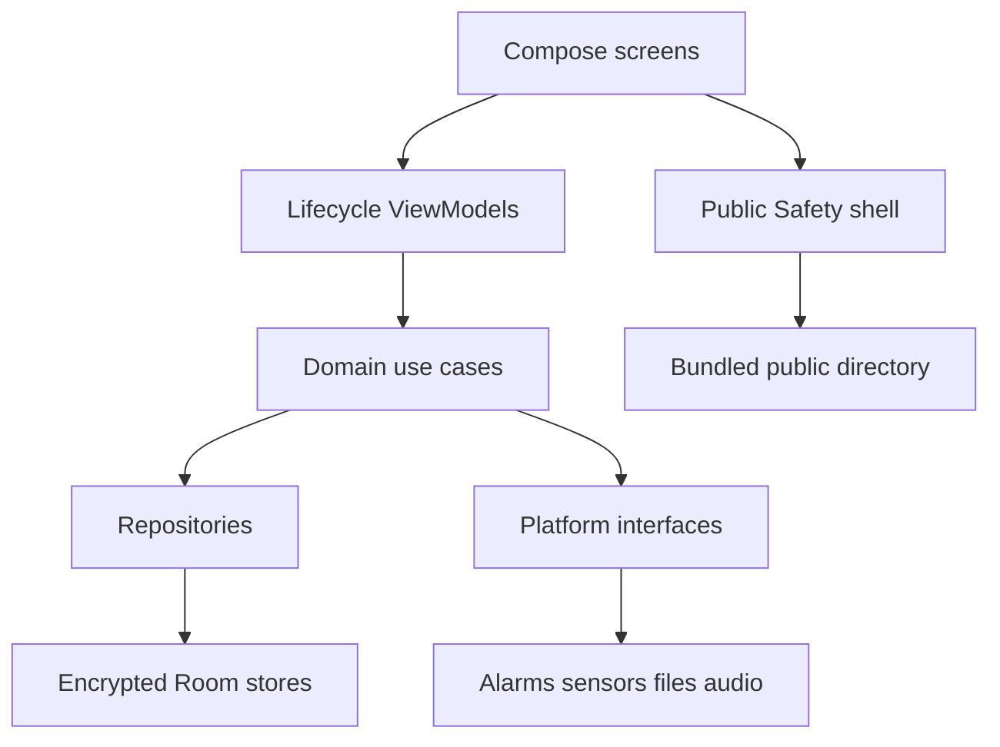

# Steady — Technical Stack and Architecture

**Specification:** 2.0 · **Date:** 6 October 2026 · **Status:** implementation target, not a build certification.

Companions: `Steady_Design_Document.md` defines interaction and appearance; `Steady_PRD.md` defines scope, priorities and acceptance requirements. The bundle includes `Source_Inventory.csv`, accounting for every non-directory entry in the nine uploaded ZIPs. Source inspection was static: no APK, build, runtime behavior or dependency combination was verified for this documentation task.

## 1. Technical decision

Build one native Android application using Kotlin, Jetpack Compose, Room with SQLCipher, Android Keystore, coroutines and lifecycle-aware ViewModels. Extend the established native Steady project after reconciling it with the current repository. Use the Expo project as a behavior and visual reference, and translate the Stitch exports into native components.

The uploaded native project is an AI Studio variant under `com.example`, with application ID `com.aistudio.steady.stdyapp`. It is not proven to be the same project or commit as the earlier GitHub implementation. Do not overwrite the repository with either ZIP. Compare package IDs, signing identity, schema, current changes and release history first. Retain the installed application's identity if it is already in use; changing identity creates a separate app and does not migrate its data.

This decision fits the Android-only objective and the platform work required for alarms, sensors, location, protected storage and optional distraction controls. React Native remains a viable technology in general; maintaining two production clients would add unnecessary work here. Do not combine npm packages with Gradle dependencies as though they were a single runtime.

## 2. Source register and authority

| ID | Material | Role |
|---|---|---|
| A | `Steady_Merged_Android_Architecture.md` | Existing privacy, time, recovery, accessibility and lifetime-use contracts |
| B | `android_blueprint_master_prompt.md` | Earlier architecture input; use only where consistent with A and the updated scope |
| E | `Steady-Android-App.zip`, `Steady/` | Expo implementation; routine anchors, Pocket Reset, daybook, review, file workflows, original orbit mark |
| N | `steady.zip` | Kotlin implementation; domain entities, Compose screens, recipe editing, workout mode concepts, AI proposal flows |
| S0 | Unnumbered Stitch ZIP | Health concept |
| S1 | Stitch `(1).zip` | Interruption screen |
| S2 | Stitch `(2).zip` | Detailed study screen |
| S3 | Stitch `(3).zip` | Today dashboard |
| S4 | Stitch `(4).zip` | Strength/workout screen |
| S5 | Stitch `(5).zip` | Compact focus screen |
| S6 | Stitch `(6).zip` | Review screen |
| U2 / U3 | `Pasted text(2).txt` / `Pasted text(3).txt` | Expansion request and accepted refinement supplied again by the user |
| C | Conversation | Lifetime daily use, personal Android focus, visual quality, phone-only fitness, no buddy component |

All seven Stitch `DESIGN.md` files have identical content hashes. They are one shared design system with seven screen exports, not seven independent systems. HTML, scripts, fonts and images are reference material; external resources referenced by HTML are not necessarily included or licensed in the ZIP.

Resolve conflicts in this order: explicit current user requirements; this reconciled specification; retained architecture contracts; prototype behavior; template boilerplate. New Health and Focus scope intentionally extends the old five-screen release. A prototype's privacy claim or checked TODO does not override its source or count as test evidence.

## 3. Observed implementation gaps

These findings identify what must be reconciled, not a claim that either supplied app was run.

| Finding | Source evidence | Required disposition |
|---|---|---|
| Two different runtimes | E `package.json`; N Gradle files | Native target; port ideas selectively |
| Plaintext native database | N `data/local/AppDatabase.kt`: ordinary Room builder, no SQLCipher factory | Encrypt personal storage; test key failures |
| Destructive migration | Same file calls `fallbackToDestructiveMigration(true)` and disables schema export | Explicit migrations and versioned exported schemas |
| Invented initial personal records | Same file seeds medical/allergy details, completed activity, water and workouts | Remove from production; isolated labeled demo only |
| Invented defaults repeat beyond seed | N `Entities.kt`, `KineticDailyTelemetry` has nonzero defaults | Defaults must be zero or unknown with source metadata |
| Simulated activity labeled as sensors | N `HealthViewModel.kt`: duration-based calories with 70 kg default, steps = minutes × 120; no sensor adapter in this flow | Manual workout label until real observation exists; remove fabricated steps |
| Minimum calorie inflation | Same file forces calories to at least 10 and duration to at least one minute | Store actual seconds and legitimate estimate, including zero |
| Aggregate drift | N `SteadyRepository.logWorkout` increments daily totals, but deletion only deletes workout | Derive/recompute affected totals transactionally |
| Habit history is not per occurrence | N `HabitItem` stores current value and streak on definition | Separate definition, schedule version, occurrence and logs |
| Missing navigation integration | N `MainActivity.kt` / `Screen.kt` expose original five tabs, not Health | Wire Health and new Focus route; keep Safety globally reachable |
| ViewModels manually remembered | N `MainActivity.kt` constructs ViewModels with `remember` | Lifecycle-owned factory and navigation state |
| Timers live in process memory | N timer ViewModels use `CountDownTimer`; E Break uses component state and interval | Persist session state and deadline; reconcile on resume |
| Skip grants full study time | N `BreakViewModel.skipToNextPhase` calls full-session logger | Log actual elapsed duration and partial/skipped status |
| Privacy wording contradicts network code | N manifest allows INTERNET; Gemini calls send prompts while UI claims data never leaves | Offline core; connected capability separately gated and disclosed |
| Safety automatically exported | N repository Markdown and JSON export include private Safety notes | Central exclusion policy; no Safety in ordinary export/backup |
| Incomplete restore | N JSON exports food/reviews but restore handles plans, notes and sessions; no atomic transaction around whole import | Strict complete schema, preview and atomic restore |
| PIN is UI state | N `SettingsViewModel.togglePinLock` holds PIN/enabled state only | Platform authentication with enforced lock lifecycle |
| Public help coupled to DB creation | N `SteadyApp()` opens DB before rendering all routes | Public Safety shell must render without DB access |
| Wrong initial region for intended user | N Safety defaults US/Canada, includes grouped country assumptions | Explicit country selection; India suggested, confirm during onboarding |
| Backup rules are templates | N manifest `allowBackup=true`; XML exclusions are commented samples | Disable platform backup and explicit exclusions, test both pathways |
| Native wrapper incomplete | N ZIP contains wrapper properties, no `gradlew`, `gradlew.bat` or wrapper JAR | Restore genuine tracked wrapper before build |
| Missing custom debug key | N build points at root `debug.keystore`, absent in archive | Use standard local debug signing, preserve release identity |
| Expo routine data not DB-encrypted | E `steady-storage.ts`: AsyncStorage; Safety uses native SecureStore, plaintext preview fallback on web | Port UX, not this persistence contract |
| Expo accepts optional Safety plaintext export | E `steady-export.ts` and Settings | Do not carry this behavior into the target |
| Silent corruption fallback | E storage catches invalid JSON and creates default data | Recovery state; preserve damaged bytes; never silently replace history |
| History depends on current definitions | E Markdown renders historical routines from today's routine list | Store title/schedule snapshots for historical accuracy |
| Starter backend exists | E `server/`, `drizzle/`, OAuth, tRPC and runtime helpers | Exclude from native core; presence is not proof personal records were uploaded |
| Limited test coverage | N example arithmetic/context tests and launch smoke test; E model tests | Keep useful cases, add feature acceptance tests |

The new ZIPs do not establish that the earlier claimed SQLCipher, migration, notification and alarm fixes are present in this variant. Treat the previous agent reports as separate evidence requiring commit reconciliation.

## 4. Stack and version policy

| Layer | Selected target | Version / release policy |
|---|---|---|
| Host | Android Studio on a capable host; JDK 17 | Record exact IDE/JDK distribution in evidence |
| Build | Gradle wrapper + Android Gradle Plugin | Candidate baseline AGP 9.2.1 / Gradle 9.4.1; prove before feature work |
| Language | Kotlin with AGP built-in Kotlin | Record resolved KGP; matching Compose compiler plugin |
| UI | Compose + Material 3 | Candidate stable BOM 2026.09.00; no independent floating Compose versions |
| SDK | minSdk 26; compileSdk 36; targetSdk 36 | Proposed target, checked against all dependencies and platform tests |
| State | ViewModel, StateFlow, coroutines | Pin stable versions proven in the compatibility build |
| Navigation | Navigation Compose | Pin stable version; typed destinations and restored tab state |
| Data | Room + KSP + SQLCipher Android | Pin and test as a set; native ABI and 16 KB page-size compatibility gate |
| Keys | Android Keystore, platform crypto, BiometricPrompt | No custom cipher or plaintext app PIN |
| Serialization | kotlinx.serialization | Typed versioned import/export DTOs |
| Preferences | DataStore for nonsensitive bootstrap only | Routine/health preferences live encrypted |
| Timers | AlarmManager + persisted domain state | WorkManager only for deferrable maintenance |
| Workouts | SensorManager and platform LocationManager adapter | Optional permissions; real sensor capability detection |
| Audio | AndroidX Media3 for bundled audio | Media-session integration if background playback ships |
| Graphics | Compose Canvas / native vector assets | Shared semantic chart wrappers; local font/image assets |
| Files | Android Storage Access Framework | User-selected documents/directories; no broad storage permission |
| Tests | JUnit, coroutine tests, Room migration tests, Compose UI, instrumentation, Macrobenchmark | Pin tooling with runtime; test what matters |
| DI | Manual constructor injection and AppContainer | Avoid a second compiler/plugin until complexity justifies it |
| Delivery | Git + existing repository + private CI if configured | Clean checkout builds; no credential in source or APK |

These are proposed reproducible baselines, not a claim every dependency has already resolved. Official AGP 9.2 documentation lists Gradle 9.4.1/JDK 17 and includes 9.2.1; Compose documentation shows BOM 2026.09.00. The actual resolved Kotlin version must be inspected rather than inferred solely from a table [W1–W3].

Observed N versions: AGP 9.1.1, wrapper URL 9.3.1, Kotlin Compose plugin 2.2.10, KSP 2.3.5, Compose BOM 2024.09.00, Room 2.7.0, minSdk 24, compile SDK 36.1, target 36, Java source/target 11. Java source compatibility is distinct from the JDK used to run Gradle. Observed E declarations: Expo ~57.0.27, React Native 0.86.3, React 19.2.3, TypeScript ~6.0.3, pnpm 9.12.0, NativeWind ^4.2.1. These are archive declarations, not independently verified releases or a compatibility endorsement.

### Dependency proof gate

1. Preserve existing repo checkpoint and identify the authoritative app ID, signing history and schemas.
2. Create one version catalog and genuine wrapper, pin distribution checksum, use official repositories, prohibit dynamic versions.
3. Resolve dependencies on JDK 17; capture compiler/KSP resolution and supported SDK requirements.
4. Build a screen, create/open an encrypted database, run one DAO operation, export a schema, exercise a migration and trigger one notification.
5. Run `assembleDebug`, `testDebugUnitTest`, `lintDebug`, then instrumented tests on an emulator/device.
6. Record command, host, commit, dependency list, output and artifact hash. If blocked, record the precise blocker. Do not infer a syscall failure from an unrelated command's error.

A proven current combination may be retained instead of mechanically upgrading to the candidate table. Document any alternative and its passing evidence. Failure to resolve a library locally is not proof it does not exist.

## 5. Component boundaries

Start with feature packages inside one app module; split Gradle modules only when useful for isolation or build time.



Recommended packages: `core/model`, `core/time`, `core/security`, `core/database`, `core/platform`, `core/designsystem`, `feature/today`, `feature/habits`, `feature/focus`, `feature/health`, `feature/review`, `feature/safety`, `feature/settings`, `feature/capture`, `feature/build`, `feature/learn`. Optional connected AI lives outside the offline dependency graph.

Composable functions accept immutable state and events. ViewModels map repository flows to screen state. Use cases implement scheduling, session transitions and restore operations. Repositories own transactions. Platform adapters implement `Clock`, `AlarmScheduler`, `NotificationGateway`, `StepSource`, `RouteTracker`, `DocumentGateway`, `AuthenticationGateway` and `AudioPlayer`. Tests substitute deterministic fakes. Do not pass Activity contexts into long-lived services.

Expose typed states: Loading, Ready, Empty, PermissionRequired, Unavailable, Locked, RecoverableError. No swallowed exception may silently fabricate a successful save. UI acknowledgments occur after persistence; a pending save has a visible state and retry affordance.

## 6. Data model and ownership

All personal entities use stable UUIDs where an external identity is unnecessary, created/updated timestamps, and a schema version. Measurement records include source, status, unit, algorithm version if estimated, and observed interval. Missing is null/unknown, not a synthetic zero.

| Entity | Main fields / invariants |
|---|---|
| ProfilePreferences | display name, units, timezone mode, day boundary, theme, accessibility, enabled modules; optional body weight with effective date |
| DailyPlan | logical day, mode Normal/Minimum/Paused, intention; unique logical-day policy snapshot |
| PlanItem | day, title, notes, category, time window, estimated seconds, state, source task ID, order |
| HabitDefinition | title, input type, unit, target, schedule, archivedAt, color/icon token |
| HabitScheduleVersion | effective date, recurrence, target snapshot; prevents changing old denominators |
| HabitOccurrence | habit ID, logical day, schedule version, due/not-due, pending/partial/done/skipped |
| HabitLog | occurrence ID, quantity/duration, timestamp, source and undo reference; append or transactional edit |
| Subject / Topic / StudyTask | optional course code, title, status, links, next action; no compulsory syllabus template |
| FocusSession | subject/task, kind study/build, target seconds, actual active seconds, state, deadline, boot context, generation |
| FocusSegment | session ID, interval, running/paused; allows day splits without duplicate session counts |
| SessionNote | session/topic, text, savedAt; optional content, no inference of correctness |
| WorkoutTemplate / Exercise | mode, ordered exercise references, optional planned sets and rest durations |
| WorkoutSession | mode, start/end, active seconds, state, source, optional effort; no forced calorie minimum |
| ExerciseSet | workout/exercise ID, reps, load and unit, done timestamp, notes; bodyweight supported |
| ActivityObservation | source record ID, interval, step delta/distance, quality, boot ID; deduplicate by source key |
| RoutePoint | workout ID, instant, latitude/longitude, accuracy; privacy-sensitive and optional |
| EnergyEstimate | source session/interval, estimated gross or active kcal, formula version, weight snapshot, MET reference |
| WaterLog / SleepLog / MealLog | user entries, timestamp/interval, quantity if applicable; no default compliance score |
| FoodIdea | title, ingredients, instructions, budget/prep tags, avoid-food tags, provenance, favorite/custom |
| CareReminder | exact user-entered instruction, schedule, optional done time; no dosing algorithm |
| Reflection | period, optional mood/energy, helped/too-demanding/evidence/adjustment fields; distinct from computed summary |
| Capture / BuildProject / LearningCard | parked ideas, bounded project contracts, retrieval/correction/review records |
| DistractionRule / InterruptionEvent | explicit app selection, schedule, pause duration, actual outcome; no inferred saved minutes |
| DashboardLayout | ordered card IDs, visibility, supported span, configuration version |
| SafetyPlan / SupportContact | private device-only store, optional fields, no invented initial records |
| ExportRecord | scope, date, result, format; no exported body, password or persistent destination secret |

Separate the private Safety store from the organiser database to make restore and export exclusion structural. Each uses an independent random key. The public country directory is bundled nonsensitive data and requires no database. Personal support contacts remain private; users see that these need to be recreated after reinstall or transfer.

### Time, history and aggregation

Default logical day: Asia/Kolkata, 04:00 boundary. An event at 03:59 belongs to the previous day; 04:00 starts the new day. Preserve recorded timezone and boundary snapshots. Changing settings applies prospectively. Legacy records imported from midnight-based apps retain their original date and a legacy day-policy marker.

Split long focus/workout segments across day boundaries for daily durations; retain one parent session with completion on its recorded completion day. Union overlapping intervals for total active time. Study and build focus share one active timer; starting a workout while focusing requires explicit pause/finish of the current activity. Passive step observations may coexist and must not double-count workout steps.

Derive dashboards from source records or rebuildable aggregates. Add/edit/delete/import operations invalidate affected dates. Use DB transactions and idempotency keys for water taps, session completion and imported observations. Never make a cached daily total the sole historical record. Archive definitions rather than removing historical labels. Habit denominator excludes not-scheduled and intentionally skipped occurrences, with skipped counts shown separately.

## 7. Timer and notification engine

Use one persisted state machine for focus, breaks, intervals and rest timers with distinct session types. States: Idle → Running ↔ Paused → Completed; Running/Paused may become Stopped. Skipped is an explicit terminal outcome where relevant. Completion means elapsed target reached, not that the user clicked next.

Store elapsed realtime anchors for same-boot calculations, wall-clock timestamps for history and boot identity for reconciliation. Display ticks are derived views; losing them does not lose the session. Resume computes remaining time. Reboot prompts recovery and does not invent continued study. A device force-stop prevents dependable scheduling until the app is opened again.

Each scheduled completion carries session ID and generation. Receiver performs a compare-and-set transaction: only the matching running generation may complete, write history and emit one cue. Pause/stop increments generation and cancels the matching alarm. PendingIntent identity must match explicitly; UPDATE_CURRENT alone is not proof cancellation works. Stale delivery is a no-op.

Use exact alarms only where eligible and granted; otherwise expose that a background cue may be delayed. Notifications have channels, runtime permission handling and privacy-safe lock-screen text. Avoid duplicate vibration/audio from manual playback plus channel behavior. In-app timers remain useful with notifications denied. Routine reminders default to no more than five a day, observe quiet hours, and do not replay a backlog after pause. User-started timer cues are separately controlled [W5].

## 8. Phone activity and workouts

Use TYPE_STEP_COUNTER when available, request activity recognition where required, record baselines and resets, and persist deltas. A rebooted counter is not a negative walk. Missing hardware/permission produces unavailable state with manual logging. Do not promise all-day coverage when the platform/OEM prevents observation [W6].

Outdoor sessions use a user-started location foreground service with an ongoing notification, explicit Stop, appropriate location permissions and location service type. Filter poor-accuracy/stale fixes; mark gaps rather than drawing impossible routes. Initial offline route view can be a locally drawn track with distance and a list of coordinates/segments; online map tiles are outside the offline build. Persist enough session state to recover an interrupted recording without silently restarting location collection [W7].

Strength uses manual reps and sets. A selected workout mode does not prove an exercise happened. Calories are optional estimates: choose documented MET references per supported mode/intensity, record weight and source assumptions, use actual active duration, distinguish gross from active expenditure, and show rounding consistent with uncertainty. A proposed formula is gross kcal = MET × 3.5 × kg × minutes / 200; active estimate uses max(MET − 1, 0). These are modeling choices requiring reference validation before release, not a Xiaomi proprietary algorithm. Omit estimates without the required inputs. Do not add resting expenditure twice.

No automatic heart rate, blood oxygen, sweat/electrolyte needs, spinal alignment, brain energy or chronotype inference from generic phone motion. Rep detection, camera form assessment, detailed running biomechanics and Health Connect import are separate gated extensions. Start battery measurement on the actual Xiaomi device before choosing a sampling policy; the prototype's 120 Hz and <1.8%/hour claims are not measurements.

## 9. Distraction controls

Level 1 is universally useful inside Steady: focus intentions, timer, manual interruption log and voluntary return-to-task prompt. Level 2 reads usage history with explicit Usage Access. It does not block other apps [W8]. Level 3, if pursued, is an optional AccessibilityService-based experiment with explicit onboarding, narrowly scoped foreground-app detection, essential-app exclusions, immediate disable and no screen-text capture.

Record a decision before shipping Level 3: device/OEM feasibility, exact permissions, permitted distribution behavior, user disclosure and test results. Do not promise a system-wide lock, prevention of uninstall, or guaranteed automatic exit after one minute. Release the voluntary flow if interception cannot meet these conditions. Do not disguise the service's purpose or automate permission grants.

## 10. Encryption, authentication and recovery

Create a random per-store database secret; wrap it with an Android Keystore AES-GCM key and unique nonce. Store only wrapped key material and metadata in app-private storage. Do not log key bytes. Confirm SQLCipher integration by creating synthetic content and inspecting database, WAL and SHM files for readable payload; absence of one marker alone is not complete cryptographic assurance [W4].

Use a platform authentication gate for private screens. Decide timeout and background relock behavior; public Safety remains accessible. A visually masked note is not authentication. A Keystore or DB failure enters a recovery state, preserves files, and never silently creates a new empty database. Destructive reset is a distinct action with clear consequences.

Keep background timer metadata minimal. When private stores are locked, the scheduler may deliver a generic cue using nonsensitive session tokens, then reconcile private history after unlock. Never store subject, medical or Safety text in an alarm payload. Define this locked-state behavior in tests rather than bypassing authentication to make timers easier.

Disable platform backup and exclude databases, files, preferences, relevant device-protected domains and key metadata from both cloud and device-transfer rules. Validate behavior on supported versions; a single manifest switch is not a substitute for testing [W9].

### Portable backup contract

Ordinary Markdown is readable text selected by scope. Portable backup is an authenticated encrypted envelope for eligible organiser records only. Safety, private contacts, keys, API credentials and live alarm tokens are excluded. Route geometry is excluded by default; a separate explicit scope preview is required to include it. An outside document provider may upload chosen files; avoid saying exported data stays on the phone.

Proposed envelope: magic, format version, schema version, KDF ID/parameters/salt, cipher ID/nonce, ciphertext and authentication tag. Use AES-256-GCM and a vetted password KDF implementation; freeze the KDF parameters after security review and target-device timing. Authenticate relevant header fields. Use fresh salt/nonce per backup. Reject unsupported algorithms and excessive KDF/memory/file-size requests before allocation; never implement cryptographic primitives manually.

Restore sequence: read bounded input → authenticate/decrypt into protected staging → validate all entities and references → preview scope/count/date range → confirm → transactionally replace eligible records while preserving destination Safety → mark in-progress sessions interrupted → invalidate/reconcile schedules → rebuild aggregates. Wrong password, tampering, unsupported version or cancellation leaves the existing database unchanged. Show provider write failures and remove temporary plaintext. Initial import bound: 25 MiB and 100,000 records; reject larger files clearly rather than truncate.

Legacy Expo JSON and N JSON need explicit version-specific adapters. Native legacy export omitted workouts/habits/telemetry and its restore omitted some exported categories; missing history cannot be reconstructed. Preview omissions, quarantine Safety content outside the ordinary import, validate integer/range/date/reference constraints, and make repeated imports idempotent using import batch/source IDs. Never turn invalid data into plausible defaults.

## 11. Optional AI and external integrations

The offline production build has no INTERNET permission, analytics, auth backend, runtime CDN dependencies or model requirement. E's Express/tRPC/MySQL/Drizzle/OAuth infrastructure is template material, not the selected stack. N's Gemini service and BuildConfig key approach must not enter the offline build.

Preserve the useful intentions as later optional capabilities: task breakdown, ingredient-based meal ideas, and rewriting a selected weekly reflection. A separately defined connected build may implement them after approval of its data-flow contract. User selects and previews exact fields; Safety and private contacts never enter a prompt. Proposals require preview/edit/apply, structured validation and explicit user action. No diagnosis, clinical prescription or automatic task insertion from arbitrary generated lines.

Keep providers and model IDs behind an interface; current hardcoded model names in N are not endorsed as valid or available. Use server-held credentials for a distributed service; a personal BYOK implementation needs explicit disclosure that secrets on a client cannot be made equivalent to server secrets. Redact requests and errors, support cancellation, quotas and offline fallback. Search queries are not citations or proof of verification; retain actual sources where available.

Markdown export to an Obsidian-accessible folder is supported. Bidirectional sync, GitHub automation, OCR, voice and cloud storage are later integrations with separate permissions and conflict rules. Imported text and links are content, never executable agent instructions.

## 12. Verification and delivery

| Layer | Required checks |
|---|---|
| Domain | 04:00 boundary, timezone changes, recurrence versioning, actual timer duration, idempotent completion, aggregate edit/delete, estimate source labeling |
| Storage | Encryption/open failure, explicit migrations from released schemas, unknown schema refusal, key loss, no destructive fallback |
| Import/export | Safety and credentials absent, round-trip all eligible categories, tampered/truncated/wrong-password failure, oversized file refusal, no partial writes |
| UI | Five tabs and Safety action, empty/error/permission states, large font, TalkBack, undo, state after rotation/process recreation |
| Device | Screen-off cue, Doze, permission denial/revocation, offline help, location stop, step reset, Xiaomi battery modes |
| Performance | Startup, scroll frames, sensor battery cost, database growth and long-history query time |
| Release | Fresh checkout, reproducible dependency resolution, APK install/update, signing identity, artifact hash and known limitations |

Performance goals are targets to measure: Today usable within two seconds on a warm launch of the target phone; visible local action response within 100 ms and durable normal save within 500 ms; p95 scroll frame under 16.7 ms in 60 Hz mode on the defined benchmark; no active sensors/location when their feature is stopped. Do not publish battery percentages until measured with scenario, duration and baseline.

Windows project terminal commands after wrapper and SDK setup:

```powershell
.\gradlew.bat --version
.\gradlew.bat :app:assembleDebug :app:testDebugUnitTest :app:lintDebug
.\gradlew.bat :app:connectedDebugAndroidTest
```

The last command requires an emulator/device; unit tests do not. On a frozen host use bounded attempts and capture logs/thread evidence where available, then transfer to a capable host. Packaging is not installation verification. Keep host credentials, local SDK paths, caches, real user data and signing keys out of source archives. Commit wrapper files, schemas, dependency catalog and acceptance evidence.

## 13. Technical decision log

| Decision | Outcome |
|---|---|
| ADR-01 | One native Android production client; E is reference material |
| ADR-02 | Five tabs Today/Health/Focus/Review/Settings; Safety independent of private storage |
| ADR-03 | Encrypted organiser and separate private Safety storage; no Safety export |
| ADR-04 | Real source records and derivable aggregates; no nonzero demo defaults |
| ADR-05 | Persistent time engine and actual durations; no ViewModel-only reliability claim |
| ADR-06 | Offline core; connected AI is an optional future variant |
| ADR-07 | Measured/manual/estimated provenance is mandatory |
| ADR-08 | App interception is gated; voluntary focus remains available |
| ADR-09 | Explicit legacy migration; no ZIP replacement or destructive schema fallback |
| ADR-10 | Build proof precedes feature expansion; immutable release evidence per commit |

## 14. External technical references

Checked 6 October 2026 unless already retrieved in this conversation. These support platform choices; proposed product behavior above remains a design decision.

- W1: [AGP 9.2 release notes](https://developer.android.com/build/releases/agp-9-2-0-release-notes).
- W2: [Built-in Kotlin migration](https://developer.android.com/build/migrate-to-built-in-kotlin).
- W3: [Compose BOM](https://developer.android.com/develop/ui/compose/bom).
- W4: [SQLCipher Android vendor documentation](https://www.zetetic.net/sqlcipher/sqlcipher-for-android/). Confirm selected distribution, licence and native artifacts during the dependency gate.
- W5: [Android alarms](https://developer.android.com/develop/background-work/services/alarms).
- W6: [Android motion sensors](https://developer.android.com/develop/sensors-and-location/sensors/sensors_motion).
- W7: [Foreground service types](https://developer.android.com/develop/background-work/services/fgs/service-types).
- W8: [UsageStatsManager](https://developer.android.com/reference/android/app/usage/UsageStatsManager).
- W9: [Android backup behavior](https://developer.android.com/identity/data/autobackup).

OpenGym source/licence and the precise Vital3D reference were not independently retrieved. Their names denote requested inspiration, not a verified dependency, endorsement or copied implementation. Resolve the exact references before any code or asset reuse.
